<p align="center">
    
</p>

Angular 2/4/5/6/7
=====================
Welcome
---------------------
Hi All, I'm **`Dinanath Jayaswal, Senior UI/Web Developer and Adobe Certified Expert Professional`**, I wanna welcome you to `Angular7 step by step guide`. In this course/tutorial will go over and learn all the fundamental building blocks of Angular, which a developer needs to know to get started developing Angular applications. Will cover from Node/NPM/Angular CLI Setup, Angular basic+advanced and common concepts like Components, Interpolation, Data Binding, Pipes, Services, Directives, Routing and Nativation, Forms, Http and Observables, etc.

Who is this for? 
---------------------
This course is for anyone and everyone, Almost everyone! Fresher/Newcomer as well as experienced UI/frontend/Web Developers who are interested in boost skills and further career - by learning new latest dynamic JavaScript framework from Google to become a hi-tech developer.

Topics include
===================== 
1. [Angular7 Introduction](#01-angular7-introduction)
2. [Getting Started](#02-getting-started)
3. [Angular First Hello World App](#03-angular-first-hello-world-app)
4. [Components](#04-components)
5. [Interpolation (Data Binding)](#05-interpolation-data-binding)
6. [Property Binding](#06-property-binding)
7. [Class Binding](#07-class-binding)
8. [Style Binding](#08-style-binding)
9. [Event Binding](#09-event-binding)
10. [Template Reference Variables](#10-template-reference-variables)
11. [Two Way Data Binding](#11-two-way-data-binding)
12. [ngIf Directive](#12-ngIf-directive)
13. [ngSwitch Directive](#13-ngSwitch-directive)
14. [ngFor Directive](#14-ngFor-directive)
15. [Component Interaction](#15-component-interaction)
16. [Pipes](#16-pipes)
17. [Services](#17-services)
18. [Dependency Injection (DI)](#18-dependency-injection-di)
19. [Using a Service](#19-using-a-service)
20. [HTTP and Observables](#20-http-and-observables)
21. [Fetch Data Using HTTP and Observables](#21-fetch-data-using-http-and-observables)
22. [Creating Custom Directives](#22-creating-custom-directives)
23. [Custom Directives with Events and @HostListener](#23-custom-directives-with-events-and-HostListener)
24. [Creating Custom Pipes](#24-creating-custom-pipes)

01 Angular7 Introduction
=====================
1.1. What is Angular:
---------------------
- Angular is a JavaScript (TypeScript based) open-source front-end web application framework from Google
- A framework to build a client-side application
- Great for SPAs (Single Page Application)
- Angular Ver2/4/5/6/7 frameworks target Mobile and Desktop
- The very first version `Angular 1.0 (1.xx)` is known as `AngularJS`, versions beyond `2+ `are generally known as `Angular`

1.2. SPA (Single Page Application)
---------------------
A SPA (Single Page Application) is a website/web applications in which part of page reload asynchronously without loading/re-loading whole page/app. It contains the menu, navigations, buttons, and blocks on a single page, as-and-when a user clicks on any of them; it dynamically rewrites/loads the current page rather than loading entire new pages from a server and so it is reactive, fast and speedy. (Web apps that load a single HTML page and dynamically update that page as the user interacts with the app).

1.3. Why to learn and use Angular:
---------------------
- Modular approach
- Re-usable code (Components)
- Development quicker and easier (Many inbuilt features helps to do development quicker+easier)
- Follows good programming practices and design patterns (MVC - Module View Controller)
- Inbuilt validations & Routing capabilities)
- Unit testable code
- Easily maintainable code
- Uses advanced features and principles like Dependency Injection, DRY (Do Not Repeat Yourself)
- Google + Microsoft collaboration (Angular + TypeScript)

1.4. Angular History:
---------------------
- The first version of Angular was Angular1.0 (AngularJS) which was released in 2010

| Year                                      | Version                                   |
| ------------------------------------------|-------------------------------------------|
| **AngularJs**   =   year 2010     =     v1.XX (1.0 version)                           |
| **Angular**     =   year 2016     =     Angular v2.0 and above (2/4/5/6/7 and coming future versions...)  |
| 2010                                      | Angular JS (Angular v1.XX versions)       |
| 2016                                      | Angular v2.0                              |
| **Version v3.0 skipped to avoid routing version 3.3.0**                               |
| 2016 December                             | Angular v4.0                              |
| 2017 November                             | Angular v5.0                              |
| 2018 April                                | Angular v6.0                              |
| 2018 October                              | Angular v7.0                              |

<h2>1.5. Difference between AngularJS and Angular<br/>
What’s new in Angular compared to AngularJS</h2>
Let’s focus through some of the main differences between AngularJS and Angular:

| AngularJs                                 | Angular                                   |
| ------------------------------------------|-------------------------------------------|
|                                           | **Angular is a complete rewrite of AngularJS**  |
| AngularJS is the name of the `first version of v1.XX (1.0 version)`.                  | Angular is the name of the Angular's `version beyond 2+ (Angular v2.0 and above i.e. 2/4/5/6/7 and coming future angular versions...)`                                                                   |
| AngularJS is a `JavaScript` based open-source front-end web application framework.    | Angular is a `JavaScript/TypeScript/Dart` based open-source front-end web application framework.     |
| AngularJS uses the concept of `scope($scope)` or `controller`.                        | Angular uses a hierarchy of `components` as its primary architectural base.                            |
| AngularJS has a simple syntax and uses to work with different directives like `ng-app`, `ng-init`, `ng-model`, `ng-for` etc.                                                               | In Angular syntax have been changed as it uses `[ ]` for property binding, and `( )` for event binding. |

1.6. Semantic Versioning System:
---------------------
- Change is nature's thumb rule, so every tool/technology/framework/library developed have to room for improvement
- Google team decided and declared that Angular major version will be upgraded twice a year with `Semantic Versioning System`
- **`Semantic Versioning System`** = `Major.Minor.Fix Patch, example: 0.0.1`
    - `Fix Patch` - can increase any time with bug fixes/patch release
    - `Minor version` - increases with every feature release which does not break any functionalities
    - `Major version` - Break in the functionalities/ extraordinary feature achievements 

02 Getting Started
=====================
2.1. Pre-requisites:
---------------------
Basic familiarity with HTML, CSS and JavaScript is must.

- HTML          - Markup
- CSS           - Style, Formates
- JavaScript    - Behaviour, Click, Validations
- TypeScript basics - Advanced JS features (Class, Arrow Function, Spread Operator)
- Text Editor / Visual Text Editors

2.2. Setup the Angular development environment:    
---------------------
In this section, we will learn how to set up a local development environment to start developing Angular apps. 

- `Node`, (website: https://nodejs.org/en) 
- `NPM`, (Node Package Manager - comes inbuilt with Node)
- `Angular CLI = Command Line Interface`, Angular CLI (Command Line Interface) for angular (website:  https://cli.angular.io/), 
    - it allows the developer to build/generate building blocks of angular application like component, services, routings, modules, etc. with best practices quicker and easier)
- `Text Editor`
    - Visual Studio Code / Visual Studio Code Insiders (website: https://code.visualstudio.com)
    - Sublime Text, 
    - Atom, 
    - Brackets etc.

2.3. Steps to Setup the Angular development environment:
---------------------
1. Download and Install node (node comes with npm) (website: https://nodejs.org/en)
<p>
  <figure>
    &nbsp;&nbsp;&nbsp; 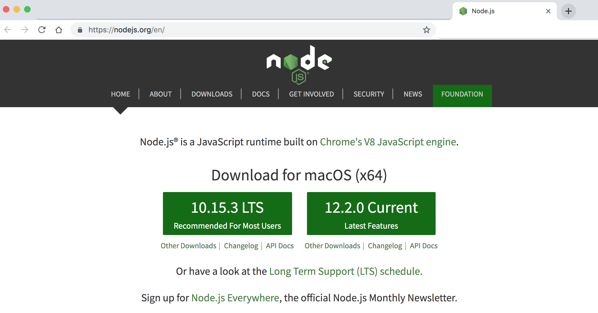
    <figcaption>&nbsp;&nbsp;&nbsp; Image - Nodejs website - https://nodejs.org/en</figcaption>
  </figure>
</p>

2. After installation check version of node and npm by command: `node -v` / `node --version` OR `npm -v` / `npm --version`
3. Install Angular CLI (website https://cli.angular.io/) by using command: `npm install -g @angular/cli` (it will install Angular CLI globally)

<p>
  <figure>
    &nbsp;&nbsp;&nbsp; 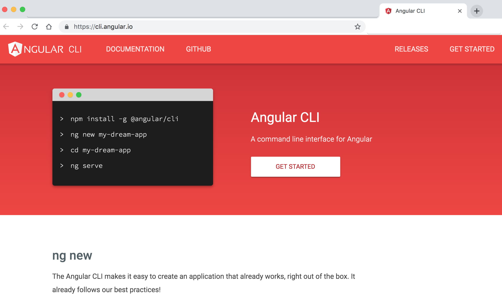
    <figcaption>&nbsp;&nbsp;&nbsp; Image - Angular CLI website - https://cli.angular.io/</figcaption>
  </figure>
</p>

4. After installation check version of angular CLI by using the command: `ng -v` OR `ng --version`
5. Create a new app with angular CLI by using syntax: `ng new project/appName` example: command: `ng new angular6-1-demo`
6. Go inside the project/app directory, command: `cd angular6-1-demo`
7. Build and run Angular App, command: `ng serve` OR `ng serve -o` OR `ng serve --open`
8. Go to the browser and launch/check Angular App by entering the web address: `localhost:4200`

2.4. Commonly / widely used node/npm commands:
---------------------
- to get Node version, type command: `node -v`  OR `node --version`
- to get NPM version, type command: `npm -v`  OR `npm --version`
- to install Angular CLI, type command: `npm install -g @angular/cli`
- to get angular CLI version, type command: `ng -v` OR `ng --version` (this command displays details of a node, npm, and other angular package versions)

03 Angular First Hello World App
=====================
3.1. Creating new Angular App
---------------------
- If using Visual Studio Code / Insiders, open Command panel/terminal from menu: View -> Terminal (shortcut key is `CTRL + BackTick` OR `COMMAND + J`)
- To create a new app with angular CLI by using syntax: `ng new project/appName` example: command: `ng new angular6-1-demo`
- Go inside the project/app directory, command: `cd angular6-1-demo OR cd appName`
- To Build and run Angular App, command: `ng serve / npm start` OR `ng serve -o` OR `ng serve --open`
- To change port from 4200 to other port - type command:  `ng serve --port 5000`
- To check the application in browser type path/url: `localhost:4200 / 5000`

3.2. Working with existing/cloned/copied Angular App
---------------------
- Clone or Download the project/app from Github or any other sources
- If using Visual Studio Code / Insiders, open Command panel/terminal from menu: View -> Terminal (shortcut key is `CTRL + BackTick` OR `COMMAND + J`)
- Go inside the project/app directory, command: `cd angular6-1-demo OR cd appName`
- To Build and run Angular App, command: `ng serve / npm start` OR `ng serve -o` OR `ng serve --open`
- To change port from 4200 to other port - type command:  `ng serve --port 5000`
- To check the application in browser type path/url: `localhost:4200 / 5000`

3.3. Angular application Architecture summary:
---------------------
- `Angular app`: (Show graphical representation of `src -> app -> components` folder)
    - Angular apps are modular in nature 
    - Consists of one or more modules (Angular App is a collection of one or many modules)
    - Modules are main feature area - User module, Admin module, Dashboard module, Employee module)
    - `Angular Application Root Module is AppModule (app.module.ts) ` 
    - `Modules` are lines of code which can be IMPORTed or EXPORTed
        - Module consists of one or more Components and Services 
        - `Components` - .HTML Template + .ts Class + .CSS 
            - A component represents/controls view in the browser
            - (example: header, footer, sidebar, common panels, common search utility, similar feature components used throughout the application)
            - `Angular Application Root (bootstrapped) component is AppComponent (app.comoponent.ts)`
        - `Services` - Class which consists of Business logic (common programming feature used throughout the application)

<p>
  <figure>
    &nbsp;&nbsp;&nbsp; 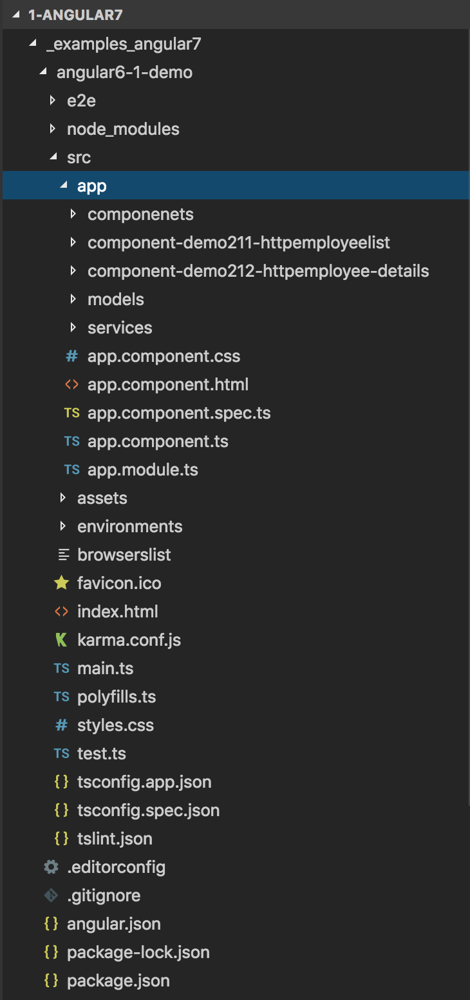
    <figcaption>&nbsp;&nbsp;&nbsp; Image - Angular Application Folder Architecture</figcaption>
  </figure>
</p>

Modules interact and ultimately render Components+Services view in the browser.

3.4. Angular application File / Folder Architecture summary:
---------------------
- `package.json`: consists of Node/NPM library/package/module dependencies for application development
- `node_modues` - folder consists of all installed packages
- `src/main.ts` - entry point to angular application. src/index.html
- `app/app.module.ts` - route module of application
- `app/app.component.ts` - route component of application
- `ng serve / npm start` -> main.ts (index.html) -> app.module.ts -> app.component.ts -> (app.component.html + css)

04 Components
=====================
- The core/key idea behind Angular is to build application using `reusable parts/chunks i.e. components`
- Components are main building blocks of UI and an/any angular application. (Show graphical representation)
- `Angular Application Root (bootstrapped) component is AppComponent (app.comoponent.ts)`

<p>
  <figure>
    &nbsp;&nbsp;&nbsp; 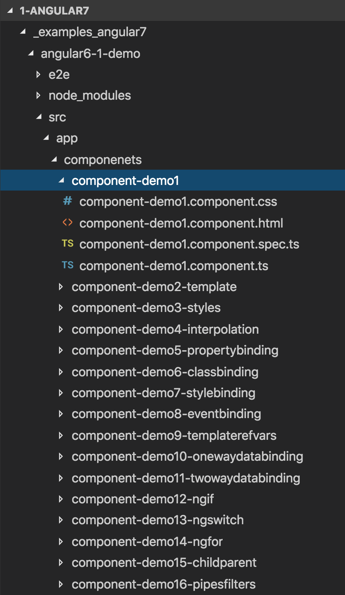
    <figcaption>&nbsp;&nbsp;&nbsp; Image - Angular Components</figcaption>
  </figure>
</p>

A component is self contained, reusable piece of UI made up of 3 important parts:
1. `Template` - `View, HTML code` (User Interface for application also known as view)
2. `Class` - `Business logic/Application logic` for the view, `TypeScript/JavaScript code`, (Data, Methods & properties)
3. `Decorator/Metadata` - `Metadata, a @function` which provide more information for angular class. example: app.component.ts: 

> **Syntax & Example**: app.component.ts
```typescript
@Component({
    selector: 'app-root', // selector - a custom html tag
    templateUrl: './app.component.html', // template/templateUrl - html view,
    styleUrls: ['./app.component.css'] // styleUrls - css style sheet
})
```

4.1. Creating component:
---------------------
- We can create component manually, but in that scenario, we need to do and follow various steps/manual entries
- It's advisable to use angular CLI to create a component, services, routing, etc. 
`To create a component using angular CLI`:
    - `syntax`: ng generate component componentName OR ng generate component path/componentName
    - `command`: ng generate component components/component-demo1 OR ng g c components/component-demo1
    - **`It generates 4 new files: .css-styles, .html-markup, .spec.ts-test, .ts-class`**
    - Also, an automated `import` /update/entry of components is done in `app.module.ts` file at the top `imports section` and in `declarations array` which consists of all the components used in the application
    - A component must be a member of/belongs to an `@NgModule - declarations array` in order for it to be usable by another component or application
    - To use current component in application, copy and paste new component `'selector'` from .ts file i.e. `'app-component-demo1'` as a tag in `app.component.html `

4.2. @Component/Decorator/Metadata details:
---------------------
### 4.2.1. selector:
- Selector is basically a `custom HTML tag used to represent current component`
- Selector helps to `render .html file/html template` in browser
- Example: index.html: `<app-root></app-root>`
- Example: app.component.html: `<app-component-demo1><app-component-demo1>`
- There are total 3 ways to specify/write and use selectors:

> **Syntax & Example**: component-demo1.component.ts
```
    1. tag: < > selector: 'app-test', example: <app-test>
    2. class: . selector: '.app-test', example: <div class="app-test">
    3. attribute / [ ]: selector: '[app-test]', example: <div app-test>
```

### 4.2.2. template:
- `template` property denotes writing html markup in current class .ts file only
- `template` property can help to write all html/markup in .ts typescript file itself
- single line can be written directly:

> **Syntax & Example**:
```typescript
template: '<h1>Inline single template Heading used - template written in same .ts file</h1>',
```

- multi line html can be written with back-tick ` ` symbol: 
> **Syntax & Example**:
```typescript
template: `
    <h1> Multiple line template </h1>
    <div> template written in same .ts file </div>
`,
```
### 4.2.3. templateUrl:
- `templateUrl` denotes/points to an `external .html` file OR 
- Write html code in another .html file and call the file path with `templateUrl` property (separation of concern)

> **Syntax & Example**: 
```typescript
templateUrl: './app.component.html', // template/templateUrl - html view,
```

> **Syntax & Example**: component-demo2-template.component.ts
```typescript
import { Component, OnInit } from '@angular/core';

@Component({
  selector: 'app-component-demo2-template',
  templateUrl: './component-demo2-template.component.html',

  // single line template
  // template: '<h1>Inline single template para used </h1>',

  // multi line template
  template:`
    <h1>component-demo2-template templateUrl works!</h1>

    <h2>template</h2>
    template denotes writing html markup in current class file only, template property can help to write all html/markup in .ts typescript file itself.
  
    <p> Multiple line template </p>
    <div> template written in same .ts file </div>
    `,
  styleUrls: ['./component-demo2-template.component.css']
})
export class ComponentDemo2TemplateComponent implements OnInit {

  constructor() { }

  ngOnInit() {
  }

}
```

### 4.2.4. styles:  
- style denotes writing `css style for current component only` - like inline css, 
- multiple css styles written inside array [ ] and back tick ` ` symbol

> **Syntax & Example**: 
```typescript
styles: [`
    h1 {
        text-align:center;
    }

    div {
        border:2px dashed gray;
    }
`]
```

### 4.2.5. styleUrls:
- `styleUrls` denotes external css file used for current component
- write css styles in another .css file and `call the file path with styleUrls` property (seperation of concern)

> **Syntax & Example**: 
```typescript
styleUrls: ['./app.component.css'] // styleUrls - css style sheet
```

> **Syntax & Example**: component-demo3-styles.component.ts
```typescript
import { Component, OnInit } from '@angular/core';

@Component({
  selector: 'app-component-demo3-styles',
  templateUrl: './component-demo3-styles.component.html',
  //styleUrls: ['./component-demo3-styles.component.css']
  styles: [`
    h1{
      text-align:center;
    }

    div{
      border:2px dashed gray;
    } 
  `]
})
export class ComponentDemo3StylesComponent implements OnInit {

  constructor() { }

  ngOnInit() {
  }

}
```

> **Syntax & Example**: component-demo1.component.ts
```typescript
import { Component, OnInit } from '@angular/core';

@Component({
  // 1. <tag/element> selector
  selector: 'app-component-demo1',
  // 2. .class selector
  // selector: '.app-component-demo1',
  // 3. [attribute] selector
  // selector: '[app-component-demo1]',
  templateUrl: './component-demo1.component.html',
  styleUrls: ['./component-demo1.component.css']
})
export class ComponentDemo1Component implements OnInit {
  private appName:string = 'Angualr 6 Application';

  constructor() { }

  ngOnInit() {
  }

}
```

> **Syntax & Example**: component-demo1.component.html
```html
<div>
  <h1>component-demo1 works! </h1>
  <ul>
    <li>{{ appName }}</li>
  </ul>

  <h2>What is Angular</h2>
  <ul>
    <li>Framework to build client side application</li>
    <li>Great for SPAs</li>
    <li>Angular 2/4/5/6/7 frameworks targets Mobile and Desktop.</li>
  </ul>
</div>
```

> **Syntax & Example**: app.component.html
```html
<!--The content below is only a placeholder and can be replaced.-->
<div class="container">

  <!-- There are total 3 ways to specify/write and use selectors: 
      tag: < >
      class: .
      attribute / [ ]
    -->

  <app-component-demo1></app-component-demo1>
  <!-- <div class="app-component-demo1"></div> -->
  <!-- <div app-component-demo1></div> -->
  <div class="custom-divider"></div>
</div>
```

> **Syntax & Example**: app.component.ts
```typescript
import { Component } from '@angular/core';

@Component({
  selector: 'app-root',
  templateUrl: './app.component.html',
  styleUrls: ['./app.component.css']
})
export class AppComponent {
  // create a property to send from parent to child
  parentMessage = 'From Parent';

  // 
  
}
```

> **Syntax & Example**: app.module.ts
```typescript
import { BrowserModule } from '@angular/platform-browser';
import { NgModule } from '@angular/core';

import { AppComponent } from './app.component';
import { ComponentDemo1Component } from './componenets/component-demo1/component-demo1.component';

@NgModule({
  declarations: [
    AppComponent,
    ComponentDemo1Component,
  ],
  imports: [
    BrowserModule,
  ],

  bootstrap: [AppComponent]
})
export class AppModule { }
```

> **Syntax & Example**: styles.css
```css
/* You can add global styles to this file, and also import other style files */

/* common global generic styles */
.custom-divider {
  margin: 30px 0px;
  border-bottom:2px dashed gray;
}

h1,h2,h3 {
  text-transform: uppercase;
  /* text-transform: capitalize; */
}

h2 {
  text-decoration: underline;
}

body {
  font-family: Cambria, Cochin, Georgia, Times, 'Times New Roman', serif;
  letter-spacing: 2px;
}

li {
  margin: 10px 0px;
}

input{
  padding: 5px;
}

button {
  border-radius: 5px;
  padding: 10px 15px;
  background-color: teal;
  border: none;
  outline: none;
  cursor: pointer;
  color: lightcyan;
}

/* class binding */
.text-primary {
  color: blue;
}

.text-danger {
  color: red;
}

.text-success {
  color: lawngreen;
}

.text-special {
  font-weight:bold;
  font-style: italic;
  color:orchid;
}

.text-strikethrough {
  text-decoration: line-through;
}
```
> **Syntax & Example**: index.html
```html
<!doctype html>
  <html lang="en">
    
    <head>
      <meta charset="utf-8">
      <title>Angular7Demo</title>
      <base href="/">

      <meta name="viewport" content="width=device-width, initial-scale=1">
      <link rel="icon" type="image/x-icon" href="favicon.ico">
    </head>

    <body>
      <app-root></app-root>
    </body>

  </html>
```

<p>
  <figure>
    &nbsp;&nbsp;&nbsp; 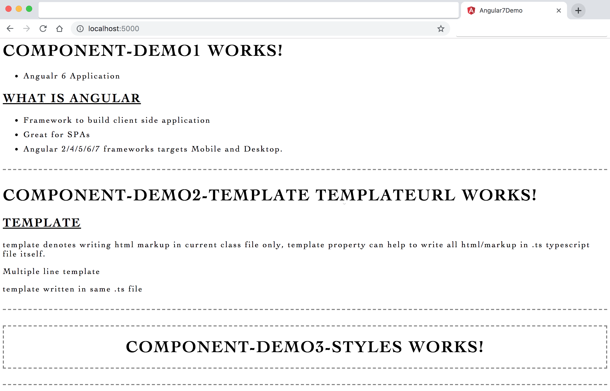
    <figcaption>&nbsp;&nbsp;&nbsp; Image - Output -  selector, templateUrl, styleUrls</figcaption>
  </figure>
</p>

05 Interpolation Data Binding
=====================
- Interpolation denotes/evaluates the content inside `{{ }} braces` and displays the value in component view file
- Interpolation = expressions, data-binding to text nodes and attribute values
- interpolation expression = {{ varName }} or {{ fn_anyReturnFunction() }}
- Angular expressions are much like `JavaScript expressions` and they can contain literals, operators, and variables
- Data binding in Angular is the `synchronization/communication between the model and the view`
- `String interpolation` is used to display dynamic data on HTML template (front end / at user end)
- Variable value assignment not possible with interpolation, Example: `{{ name = 'Dinanath' or Total = 10 + 20 }}`

> **Syntax & Example**: component-demo4-interpolation.component.ts
```typescript
import { Component, OnInit } from '@angular/core';

@Component({
  selector: 'app-component-demo4-interpolation',
  templateUrl: './component-demo4-interpolation.component.html',
  styleUrls: ['./component-demo4-interpolation.component.css']
})
export class ComponentDemo4InterpolationComponent implements OnInit {
  // variables - class members
  public technology = 'Angular 6';
  public userName = 'Dinanath';
  // public siteUrl = 'http://www.google.com';
  public siteUrl = window.location.href;

  fn_showGreetingsToUser() {
    return 'Welcome ' + this.userName;
  }

  fn_showMessage() {
    return 'Welcome to ' + this.technology + ' ' + this.userName;
  }

  constructor() { }

  ngOnInit() {
  }

}
```

> **Syntax & Example**: component-demo4-interpolation.component.html
```html
<div>
  <h1>component-demo4-interpolation works!</h1>
  <ul>
    <li>maths = 2+2 = {{ 2+2 }}</li>
    <li>{{ "Welcome " + userName }}</li>
    <li>userName.length = {{ userName.length }}</li>
    <li>toUpperCase = {{ userName.toUpperCase() }}</li>
    <li>toLowerCase = {{ userName.toLowerCase() }}</li>
    <li>current Site URL: {{ siteUrl }}</li>
    <li>function call: {{ fn_showGreetingsToUser() }}</li>
    <li>function call: {{ fn_showMessage() }}</li>
  </ul>
</div>
```

> **Syntax & Example**: app.module.ts
```typescript
import { BrowserModule } from '@angular/platform-browser';
import { NgModule } from '@angular/core';

import { AppComponent } from './app.component';
import { ComponentDemo1Component } from './componenets/component-demo1/component-demo1.component';
import { ComponentDemo2TemplateComponent } from './componenets/component-demo2-template/component-demo2-template.component';
import { ComponentDemo3StylesComponent } from './componenets/component-demo3-styles/component-demo3-styles.component';
import { ComponentDemo4InterpolationComponent } from './componenets/component-demo4-interpolation/component-demo4-interpolation.component';
import { ComponentDemo5PropertybindingComponent } from './componenets/component-demo5-propertybinding/component-demo5-propertybinding.component';

@NgModule({
  declarations: [
    AppComponent,
    ComponentDemo1Component,
    ComponentDemo2TemplateComponent,
    ComponentDemo3StylesComponent,
    ComponentDemo4InterpolationComponent,
  ],
  imports: [
    BrowserModule,
  ],

  bootstrap: [AppComponent]
})
export class AppModule { }
```
> **Syntax & Example**: app.component.html
```html
<!--The content below is only a placeholder and can be replaced.-->
<div class="container">

  <!-- There are total 3 ways to specify/write and use selectors: 
      tag: < >
      class: .
      attribute / [ ]
    -->

  <app-component-demo1></app-component-demo1>
  <!-- <div class="app-component-demo1"></div> -->
  <!-- <div app-component-demo1></div> -->
  <div class="custom-divider"></div>

  <!-- component decorator template -->
  <app-component-demo2-template></app-component-demo2-template>
  <div class="custom-divider"></div>

  <!-- css style -->
  <app-component-demo3-styles></app-component-demo3-styles>
  <div class="custom-divider"></div>

  <!-- interpolation -->
  <app-component-demo4-interpolation></app-component-demo4-interpolation>
  <div class="custom-divider"></div>

</div>
```

<p>
  <figure>
    &nbsp;&nbsp;&nbsp; 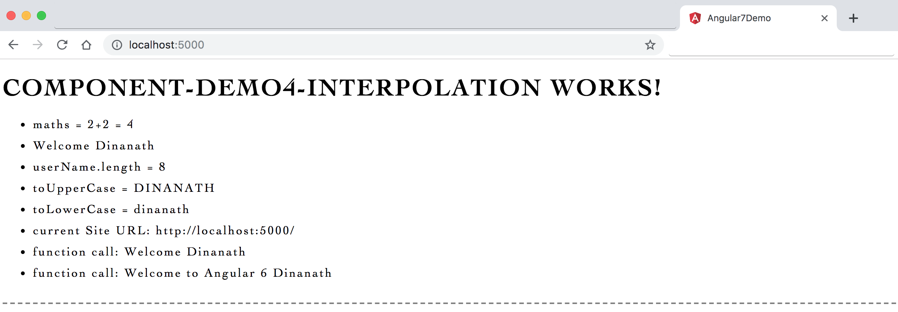
    <figcaption>&nbsp;&nbsp;&nbsp; Image - Output - Interpolation Data Binding {{ }}</figcaption>
  </figure>
</p>

06 Property Binding
=====================
- String Interpolation and Property binding both are used for the same purpose i.e. one-way Data Binding
- String Interpolation and Property Binding both `flow value in one direction from our components to HTML elements`
- Basic Attributes are defined by HTML BUT `"value"` kind of dynamic attributes (properties) which are like properties are defined and managed by DOM
- `Attributes and properties are NOT the same`<br/>
    - `Attributes` = HTML &nbsp; &nbsp; &nbsp; &nbsp; &nbsp; | &nbsp; &nbsp; &nbsp; &nbsp; &nbsp; `Properties` = DOM (Document Object Model)
- Attributes initialise DOM properties and then they are done - cannot change once they are initialised
- Property values however can change, HTML attribute value specifies initial value and the `DOM value property is the current value`

> **Syntax & Example**: Property Binding is done with [square bracket] OR bind-properyName:

```html
example: <input type="text" value="dinanath" />
```

- type in console:$0.getAttribute("value");   output:"dinanath"  
- type in console:$0.value;   output:"dinanath" 
- Now type something new in text field "new Text"
- type in console:$0.getAttribute("value");   output:"dinanath"  
- type in console:$0.value;   output:"new Text"
- > **Note**: Attribute does not changed but `value property changed`
- `Property Binding done with [ ] square bracket` also with `{{ interpolation }}` But its advisable to use [ ] as its supports string, boolean all property types, boolean value like true/false etc does not works well with {{ interpolation }}

> **Syntax & Example**: component-demo5-propertybinding.component.ts
```typescript
import { Component, OnInit } from '@angular/core';

@Component({
  selector: 'app-component-demo5-propertybinding',
  templateUrl: './component-demo5-propertybinding.component.html',
  styleUrls: ['./component-demo5-propertybinding.component.css']
})
export class ComponentDemo5PropertybindingComponent implements OnInit {
  public _id = 'id1';
  public _isDisabled1 = true;
  public _isDisabled2 = false;

  constructor() { }

  ngOnInit() {
  }

}
```

> **Syntax & Example**: component-demo5-propertybinding.component.html
```html
<div>
  <h1>component-demo5-propertybinding works!</h1>

  <h3>attributes vs value</h3>
  <input size="40" type="text" value="angular property binding" />

  <h3 ngNonBindable>property binding [ ] vs interpolation {{ ngNonBindable }} </h3>

  <input type="text" [id]="_id" value="[ ] property-binding" /><br />
  <input type="text" id="{{_id}}" value="{ } interpolation property-binding" /> <br /> <br />

  <h3>attribute boolean (property) interpolation does not support </h3>
  <input type="text" disabled="false" [id]="_id" value="boolean false not works" /><br />
  <input type="text" disabled="true" [id]="_id" value="boolean true not works" /> <br /> <br />

  <h3>property binding boolean values supported  </h3>
  <input type="text" [disabled]="false" [id]="_id" value="[property-binding] works" /><br />
  <input type="text" [disabled]="true" [id]="_id" value="[property-binding] works" /><br /> <br />

  <h3>property binding boolean property with variable </h3>
  <input type="text" [disabled]="_isDisabled1" [id]="_id" value="[ var ] disabled works" /><br />
  <input type="text" [disabled]="_isDisabled2" [id]="_id" value="[ var ] enabled works" /><br />

  <h3>property binding with bind- </h3>
  <input type="text" bind-disabled="_isDisabled1" [id]="_id" value="[ var ] disabled works" /><br />
  <input type="text" bind-disabled="_isDisabled2" [id]="_id" value="[ var ] enabled works" /><br />

</div>
```

<p>
  <figure>
    &nbsp;&nbsp;&nbsp; 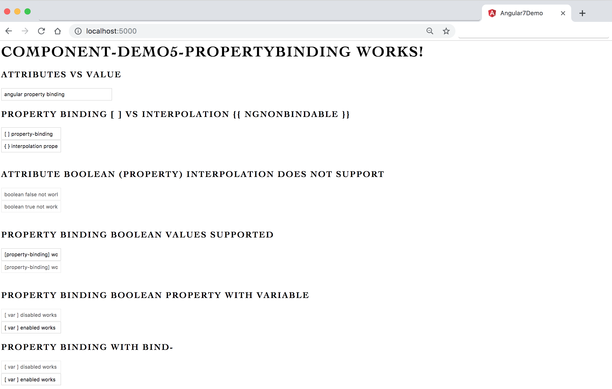
    <figcaption>&nbsp;&nbsp;&nbsp; Image - Output - Property binding with {{}}, [ ] and bind- </figcaption>
  </figure>
</p>

07 Class Binding
=====================
- Class binding refers to applying different classes normally or depends on condition (dynamically)
- Class binding is very important and really useful as it allows developer to apply/add and remove classes to html element dynamically based on condition or user interaction
- Class Binding Syntax: `<tag [class]="varName" />`, here `varName holds css className`
- If `[class] binding` and `class=" "` attribute both present in tag, `[class] binding` get first/higher priority and `class=" "` attribute becomes null & void (class style properties not applied to text -  so its advisable to use any one either class binding or class attribute)
- `[ngClass]` directive/attribute helps to apply multiple classes conditionally `<tag [ngClass]="varObjectName"`

> **Syntax & Example**: styles.css (write css classes in any file)
```css
.text-primary {
  color: blue;
}

.text-danger {
  color: red;
}

.text-success {
  color: lawngreen;
}

.text-special {
  font-weight:bold;
  font-style: italic;
  color:orchid;
}

.text-strikethrough {
  text-decoration: line-through;
}

.text-orange {
  color: orange;
}
```

> **Syntax & Example**: component-demo6-classbinding.component.ts
```typescript
import { Component, OnInit } from '@angular/core';

@Component({
  selector: 'app-component-demo6-classbinding',
  templateUrl: './component-demo6-classbinding.component.html',
  styleUrls: ['./component-demo6-classbinding.component.css']
})
export class ComponentDemo6ClassbindingComponent implements OnInit {
  public successClass = 'text-success';
  public dangerClass = 'text-danger';
  public isSpecialClass = true;
  public isErrorClass = true;

  public messageClasses = {
    'text-primary': this.isSpecialClass,
    'text-strikethrough': this.isSpecialClass
  }

  constructor() { }

  ngOnInit() {
  }

}
```

> **Syntax & Example**: component-demo6-classbinding.component.html
```html
<div>
  <h1>component-demo6-classbinding works! </h1>

  <h3 ngNonBindable>[class]="varName" (varName holds css className present in css)</h3>

  <h4 class="text-orange">simple class attribute</h4>
  
  <h4 [class]="successClass">This is class binding with []</h4>

  <h4 class="{{successClass}}">This is class binding with interpolation</h4>

  <h4 [class]="successClass" class="text-orange">This is class binding with [] also class attribute</h4>

  <h4 [class.text-special]="isSpecialClass">This is class binding with boolean variable condition </h4>

  <h4 [class.text-danger]="isErrorClass">This is class binding with boolean variable condition </h4>

  <h4 [ngClass]="messageClasses">This is ngClass binding to deal with multiple classes at once</h4>
  
</div>
```

<p>
  <figure>
    &nbsp;&nbsp;&nbsp; 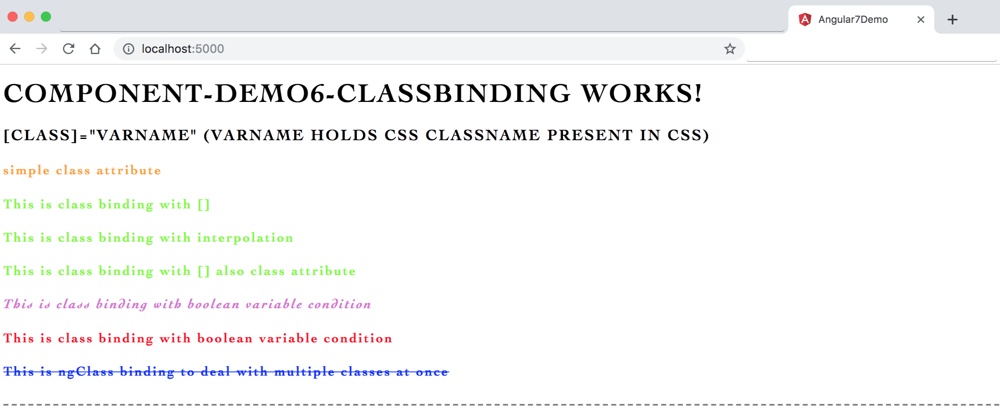
    <figcaption>&nbsp;&nbsp;&nbsp; Image - Output - Class binding with {{}}, [ ] and ngClass</figcaption>
  </figure>
</p>

08 Style Binding
=====================
- Style binding is similar to class binding but it refers to applying different inline styles to html element instead of applying css classes
- Style Binding Syntax: 
```
<tag [style.color]="'orange'"> text </tag> 
OR 
<tag [style.color]="'varName'"> text </tag>
```
- `[ngStyle]` directive/attribute helps to apply multiple inline styles `<tag [ngStyle]="varObjectName"`

> **Syntax & Example**: component-demo7-stylebinding.component.ts 
```ts
import { Component, OnInit } from '@angular/core';

@Component({
  selector: 'app-component-demo7-stylebinding',
  templateUrl: './component-demo7-stylebinding.component.html',
  styleUrls: ['./component-demo7-stylebinding.component.css']
})
export class ComponentDemo7StylebindingComponent implements OnInit {
  public greenColor = 'green';
  public redColor = 'red';
  public orangeColor = 'orange';
  public hasError = true;

  public headerStyles = {
    color: 'blue',
    textDecoration: 'line-through',
    fontStyle: 'italic'
  }

  constructor() { }

  ngOnInit() {
  }

}
```

> **Syntax & Example**: component-demo7-stylebinding.component.html
```html
<div>
  <h1>component-demo7-stylebinding works!</h1>

  <h3 ngNonBindable> &lt;tag [style.color]="'orange'"&gt; text &lt;/tag&gt;</h3>
  <h4 [style.color]="'orange'">applying inline styles</h4>

  <h3 ngNonBindable> &lt;tag [style.color]="'varName'"&gt; text &lt;/tag&gt;</h3>
  <h4 [style.color]="greenColor">applying inline styles with variable </h4>

  <h3 ngNonBindable> &lt;style.color]="hasError ? 'red' : 'green' "&gt; text &lt;/tag&gt;</h3>
  <h4 [style.color]="hasError ? 'red' : 'green' ">applying inline styles with variable conditions</h4>

  <h4 [ngStyle]="headerStyles">applying multiple inline styles</h4>
</div>

```

<p>
  <figure>
    &nbsp;&nbsp;&nbsp; 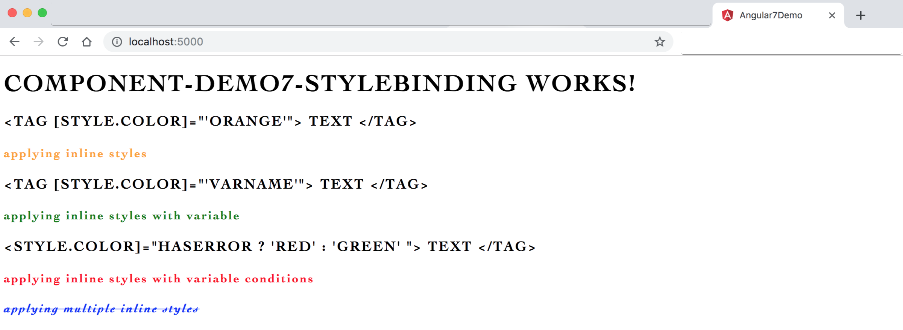
    <figcaption>&nbsp;&nbsp;&nbsp; Image - Output - Style binding with [style.] and [ngStyle]</figcaption>
  </figure>
</p>

09 Event Binding
=====================
- Event binding captures any DOM event and performs actions
- Angular provides an ability to bind the events along with the methods, Event binding is used with `parenthesis ()`
- Usually data binding done from Component Class `.ts` to Component Template `.html` (variables in class .ts files used/bind with html/template .html)
- To responds to user events like mouse clicks or keyboard events we need data flow from TEMPLATE to CLASS, event binding flows from TEMPLATE to CLASS (.HTML/TEMPLATE/VIEW to .TS/CLASS file)
- Syntax: `<h1 (click)="fn()">Click Me - Change Style</h1>`

> **Syntax & Example**: component-demo8-eventbinding.component.ts
```ts
import { Component, OnInit } from '@angular/core';

@Component({
  selector: 'app-component-demo8-eventbinding',
  templateUrl: './component-demo8-eventbinding.component.html',
  styleUrls: ['./component-demo8-eventbinding.component.css']
})
export class ComponentDemo8EventbindingComponent implements OnInit {
  public isButtonClicked = false;
  public greetingMessage = '';
  public eventType = '';
  // public withoutHandlerMessage = '';

  fn_changeStyles() {
    this.isButtonClicked = !this.isButtonClicked;
    this.greetingMessage = 'welcome to event binding';
  }

  fn_checkClick(evt) {
    console.log(evt);
    this.eventType = evt.type;
  }

  constructor() { }

  ngOnInit() {
  }

}
```

> **Syntax & Example**: component-demo8-eventbinding.component.html
```html
<div>
  <h1>component-demo8-eventbinding works!</h1>

  <h2>Event Binding</h2>

  <h1 (click)="fn_changeStyles()" [class.text-primary]="isButtonClicked" style="cursor:pointer;">Click Me - Change Style</h1>

  <div>isButtonClicked: {{isButtonClicked}}.  | {{isButtonClicked ? greetingMessage : " "}} </div> <br /><br />

  <button (click)="fn_checkClick($event)">Click me!</button> Event: {{eventType}} 

  <button (click)="withoutHandlerMessage = 'Without handler function' ">Without handler function - Click me!</button> {{withoutHandlerMessage}}

</div>
```

<p>
  <figure>
    &nbsp;&nbsp;&nbsp; 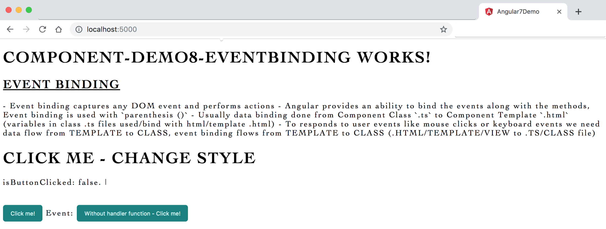
    <figcaption>&nbsp;&nbsp;&nbsp; Image - Event binding with (click)</figcaption>
  </figure>
</p>

<p>
  <figure>
    &nbsp;&nbsp;&nbsp; 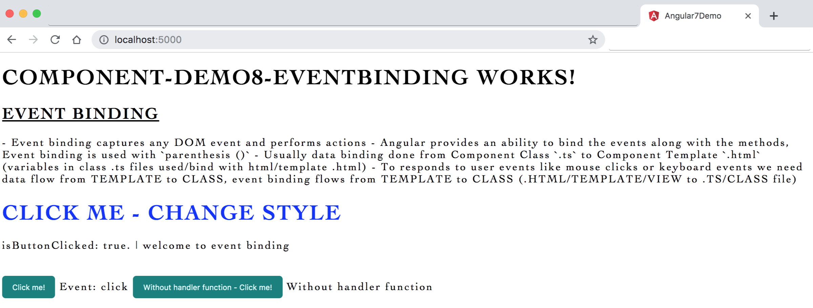
    <figcaption>&nbsp;&nbsp;&nbsp; Image - Output - Event binding with (click) - After Click</figcaption>
  </figure>
</p>

10 Template Reference Variables
=====================
- When there is a user interaction we may want some data to flow from VIEW/TEMPLATE (.HTML) to the class .TS) to perform some operation  
    - Example: value from input fields to perform some validation etc
- To easily access DOM elements and their properties, Template Reference Variables is used
- Template Reference Variables is created with #hash symbol followed by var name i.e. `#heading1`
- Syntax: `<h1 #heading1>I am heading 1</h1>`, here `#heading1` is Template Reference Variable (a dynamic name/id) assigned to h1 tag

> **Syntax & Example**: component-demo9-templaterefvars.component.ts
```ts
import { Component, OnInit } from '@angular/core';

@Component({
  selector: 'app-component-demo9-templaterefvars',
  templateUrl: './component-demo9-templaterefvars.component.html',
  styleUrls: ['./component-demo9-templaterefvars.component.css']
})
export class ComponentDemo9TemplaterefvarsComponent implements OnInit {
  logDetails(_value) {
    console.log(_value);
  }

  constructor() { }

  ngOnInit() {
  }

}
```

> **Syntax & Example**: component-demo9-templaterefvars.component.html
```html
<div>
  <h1>component-demo9-templaterefvars works!</h1>

  <h2>Template Reference Variables</h2>
 
  <input #textInput type="text" placeholder="Enter Name" /> &nbsp; &nbsp;

  <button (click)="logDetails(textInput)">Get Input Field</button> &nbsp; &nbsp;

  <button (click)="logDetails(textInput.value)">Get Value of field </button> &nbsp; &nbsp;

</div>
```

<p>
  <figure>
    &nbsp;&nbsp;&nbsp; 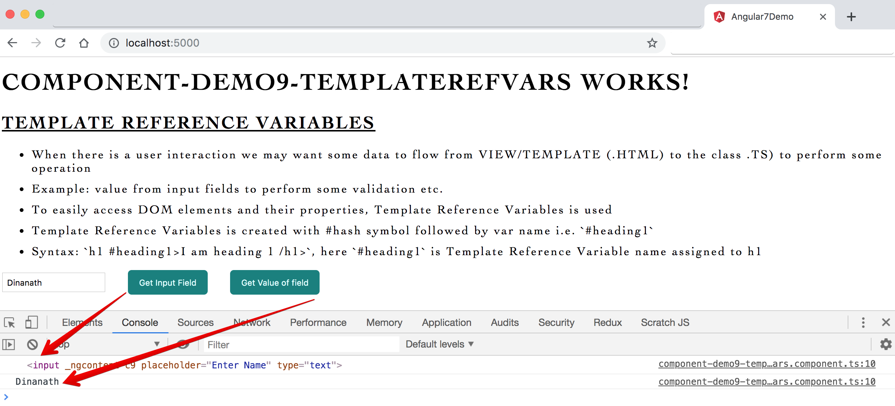
    <figcaption>&nbsp;&nbsp;&nbsp; Image - Output - Template Reference Variables</figcaption>
  </figure>
</p>

11 Two Way Data Binding
=====================
- Data binding is one of the most powerful features of Angular, used widely for communication between TypeScript code (.ts - business logic) and different components (.html - view/template) shown to the users
- Whenever we work with Input Form fields its necessary/essentials that MODEL (data) and VIEW (template) both syncs well (any changes into HTML field should update the model/property and any updates/changes in model/property/variable than view should reflect those updated values)
- There are two types of data binding:
    1. One way data binding 
    2. Two way data binding 

11.1. One way data binding
---------------------
- One way data binding is a simple/normal one way communication where HTML template is changed when any changes to TypeScript code/model/data/variable
- In one way data binding value of Model is used in the View (HTML) but we can't update Model from the View (.HTML Template)
- Example:  Interpolation / String Interpolation, Property Binding, and Event Binding
- One way data binding works from class .ts file to template/view .html file:

> **Syntax & Example**: component-demo10-onewaydatabinding.component.ts
```ts
import { Component, OnInit } from '@angular/core';

@Component({
  selector: 'app-component-demo10-onewaydatabinding',
  templateUrl: './component-demo10-onewaydatabinding.component.html',
  styleUrls: ['./component-demo10-onewaydatabinding.component.css']
})
export class ComponentDemo10OnewaydatabindingComponent implements OnInit {
  public inputResultValue = 'One Way Data Binding!';

  public userNameText = 'Angular 7';

  public changeInputText(evt) {
    console.log(evt);
    this.userNameText = evt.target.value;
  }

  constructor() { }

  ngOnInit() {
  }

}
```

> **Syntax & Example**: component-demo10-onewaydatabinding.component.html
```html
<div>
  <h1>component-demo10-onewaydatabinding works!</h1>

  <h2>One way data binding</h2>
  One way data binding works from class .ts file to template/view .html file: <br /> <br />
  <input type="text" value={{inputResultValue}} /> <br />
  <input type="text" [value]=inputResultValue /> <br />
  <input type="text" bind-value=inputResultValue /> <br />

  <h2>One Way Data Binding works as Two way (work around)</h2>
  <input type="text" placeholder="Enter Name" [value]="userNameText" (input)="changeInputText($event)" /> &nbsp;&nbsp;
  <span><em><strong>{{userNameText}}</strong></em></span>
  
</div>
```
<p>
  <figure>
    &nbsp;&nbsp;&nbsp; 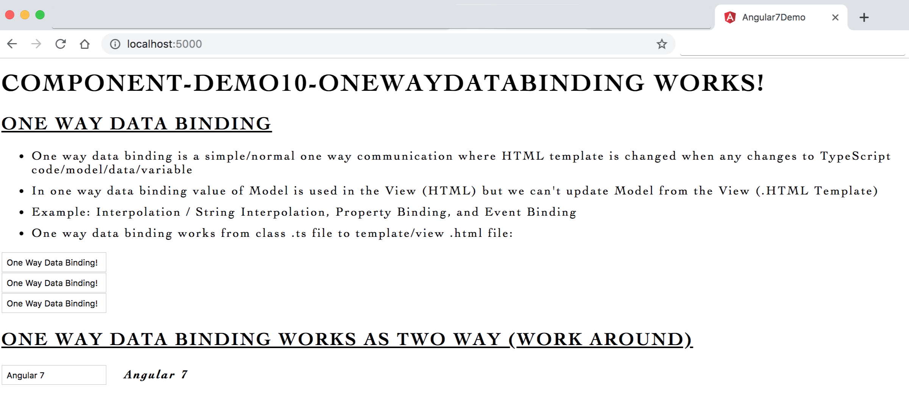
    <figcaption>&nbsp;&nbsp;&nbsp; Image - Simple one way data binding with {{}}, [ ] and bind-</figcaption>
  </figure>
</p>

<p>
  <figure>
    &nbsp;&nbsp;&nbsp; 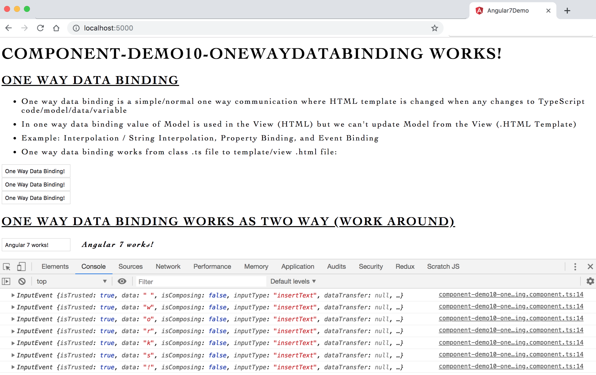
    <figcaption>&nbsp;&nbsp;&nbsp; Image - Output - Simple one way data binding with {{}}, [ ] and bind-, used as two way data binding</figcaption>
  </figure>
</p>

11.2. Two way data binding
---------------------
- Two Way Data Binding helps to update the property at the same time displays the value of the property
- In two way data binding, `automatic synchronization of data happens between the Model and the View`
- Here whenever we make changes in the Model(data/variable) it will be reflected in the View and when you make changes in View(HTML/template) it will be reflected in Model
- `"ngModel"` Directive is used to implement Two Way Data Binding (basically VIEW & MODEL should always be sync) 
- `[ ] square bracket/property binding` is used for data flow from class to the template and `( ) parentheses/event binding` for data from template to class 
- `[(ngModel)]` - this syntax is known as `[(banana in the box)]`
- To use `[(ngModel)]` Directive we must need to `import FormsModule` from `@angular/forms` and also add to imports array in app.module.ts: `import { FormsModule } from '@angular/forms';`
- > **Note**: In two way data binding value flow from an Input Text field to the class file and then to view/template file

> **Syntax & Example**: app.module.ts
```ts
// import forms module for two way data binding
import { FormsModule } from '@angular/forms';

imports: [
    BrowserModule,
    FormsModule
  ],
```

> **Syntax & Example**: component-demo11-twowaydatabinding.component.ts
```ts
import { Component, OnInit } from '@angular/core';

@Component({
  selector: 'app-component-demo11-twowaydatabinding',
  templateUrl: './component-demo11-twowaydatabinding.component.html',
  styleUrls: ['./component-demo11-twowaydatabinding.component.css']
})
export class ComponentDemo11TwowaydatabindingComponent implements OnInit {
  public nameText = 'Angular 6';
  
  constructor() { }

  ngOnInit() {
  }

}
```

> **Syntax & Example**: component-demo11-twowaydatabinding.component.html
```html
<div>
  <h1>component-demo11-twowaydatabinding works!</h1>

  <h2>Two way data binding</h2>
  
  <input type="text" [(ngModel)]="nameText" placeholder="Enter Name"/> {{nameText}}
  
</div>
```

<p>
  <figure>
    &nbsp;&nbsp;&nbsp; 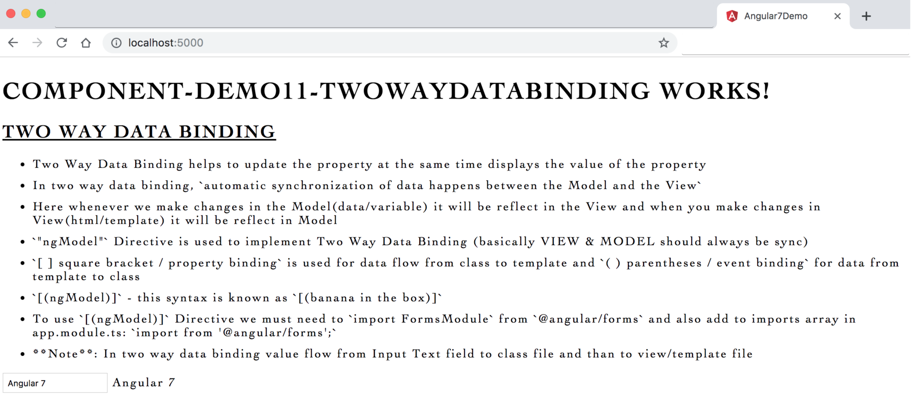
    <figcaption>&nbsp;&nbsp;&nbsp; Image - Output - Two way data binding with [(ngModel)], FormsModule</figcaption>
  </figure>
</p>

12 ngIf Directive
=====================
- Directives are an `instructions in the DOM`, they specify how to place your components and business logic in the Angular
- Directives are js class and `declared as @directive`
- There are 3 main types of directives in Angular:
    1. **Component Directives** - Component directives are used in `main class (app.component.ts)`. They contain the detail of how the component should be processed, instantiated and used at runtime
    2. **Structural Directives** - Structural Directives let us `Add or Remove (Show or Hide) HTML elements` from DOM. Structural directives `start with a * sign`. These directives are used to `manipulate and change the structure of the DOM elements`. For example, *ngIf and *ngFor etc.
    3. **Attribute Directives** - Attribute directives `look like a normal HTML Attribute` and mainly used in `databinding and event binding`. Attribute directives are used to `change the look and behavior of the DOM elements`. Attribute Directives affect only the element they are added to. For example: ngClass, ngStyle etc. 
- Most important/widely used inbuilt Structural directives are: 
    - **ngIf** - conditionally render/show-hide html elements 
    - **ngSwitch** - conditionally render/show-hide html elements 
    - **ngFor** - render/show list of html elements through loop

*ngIf
---------------------
- *ngIf directive is used to change the output conditionally
- If the condition is false, the DOM element does not render
- With *ngIf use truthy or falsy value which conditionally renders the DOM elements
- `ng-template` is like a container for chunks/group of HTML elements controlled once

> **Syntax & Example**: component-demo12-ngif.component.ts
```ts
import { Component, OnInit } from '@angular/core';

@Component({
  selector: 'app-component-demo12-ngif',
  templateUrl: './component-demo12-ngif.component.html',
  styleUrls: ['./component-demo12-ngif.component.css']
})
export class ComponentDemo12NgifComponent implements OnInit {
  public isShow=true;
  public hasDisplay=false;

  constructor() { }

  ngOnInit() {
  }

}
```

> **Syntax & Example**: component-demo12-ngif.component.html
```html
<div>
  <h1>component-demo12-ngif works!</h1>

  <h2>*ngIf</h2>
  
  <ul>
    <li *ngIf="true">Show me </li>
    <li *ngIf="false">I am NOT rendered in DOM </li>
    <li *ngIf="isShow">Please show me - conditional variable/property from class</li>
  </ul>

  <h2>ngIf else ng-template</h2>
  If condition is false, different DOM element renders as specified in "ng-template else">

  <!-- variable true - show me, else show other ng-template -->
  <div *ngIf="hasDisplay; else elseTemplate">
    <h5>I have used in ngIf TRUE part</h5>
  </div>

  <ng-template #elseTemplate>
    <h5>I am using ngIf FALSE/ELSE part in ng-template</h5>
  </ng-template>

  <h2>ngIf - ng-template else ng-template</h2>
  depends on variable/condition show ng-template1 else show other ng-template2

  <!-- variable true then show ng-template1 else show other ng-template2 -->
  <div *ngIf="hasDisplay; then trueTemplate; else falseTemplate"></div>

  <ng-template #trueTemplate>
    <h5>I am #trueTemplate</h5>
  </ng-template>

  <ng-template #falseTemplate>
    <h5>I am #falseTemplate</h5>
  </ng-template>

</div>
```

<p>
  <figure>
    &nbsp;&nbsp;&nbsp; 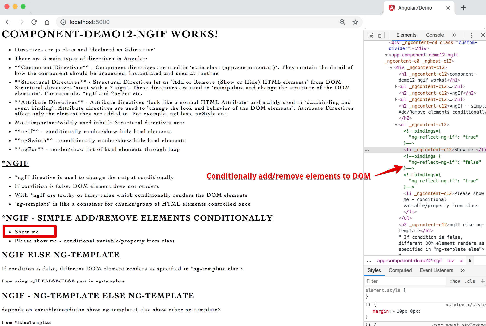
    <figcaption>&nbsp;&nbsp;&nbsp; Image - Output - *ngIf - Structural directive to control/add/remove elements to DOM conditionally</figcaption>
  </figure>
</p>

13 ngSwitch Directive
=====================
- ngSwitch directive is similar to other programming languages swtich statement, only the `difference is with angular we render HTML elements instead of executing logics`

> **Syntax & Example**: component-demo13-ngswitch.component.ts
```ts
import { Component, OnInit } from '@angular/core';

@Component({
  selector: 'app-component-demo13-ngswitch',
  templateUrl: './component-demo13-ngswitch.component.html',
  styleUrls: ['./component-demo13-ngswitch.component.css']
})
export class ComponentDemo13NgswitchComponent implements OnInit {
  public curColor='red';
  // public curColor='green';
  // public curColor = 'blue';

  // public curColor = 'black';

  constructor() { }

  ngOnInit() {
  }

}
```

> **Syntax & Example**: component-demo13-ngswitch.component.html
```html
<div>
  <h1>component-demo13-ngswitch works!</h1>

  <h2>*ngSwtich</h2>

  <div [ngSwitch]="curColor">
    <div *ngSwitchCase="'red'" [style.color]="curColor">RED | {{curColor}} | color</div>
    <div *ngSwitchCase="'green'" [style.color]="curColor">GREEN | {{curColor}} | color</div>
    <div *ngSwitchCase="'blue'" [style.color]="curColor">BLUE | {{curColor}} | color</div>
    <div *ngSwitchDefault>Default BLACK</div>
  </div>

</div>
```

<p>
  <figure>
    &nbsp;&nbsp;&nbsp; 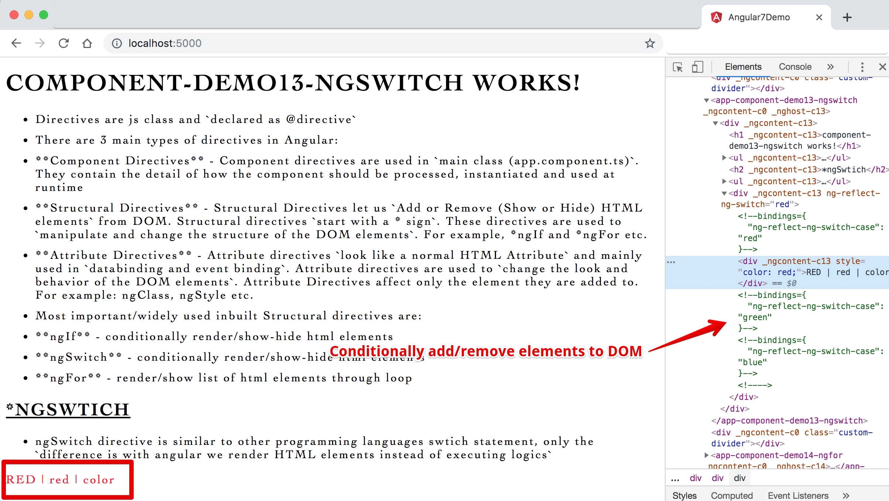
    <figcaption>&nbsp;&nbsp;&nbsp; Image - Output - *ngSwitch - Structural directive to control/add/remove elements to DOM conditionally</figcaption>
  </figure>
</p>

14 ngFor Directive
=====================
- ngFor directive is similar to other programming languages for loop statement, only the `difference is with angular we render the list of HTML elements instead of executing logics`

> **Syntax & Example**: component-demo14-ngfor.component.ts
```ts
import { Component, OnInit } from '@angular/core';

@Component({
  selector: 'app-component-demo14-ngfor',
  templateUrl: './component-demo14-ngfor.component.html',
  styleUrls: ['./component-demo14-ngfor.component.css']
})
export class ComponentDemo14NgforComponent implements OnInit {
  // public arrColors = ['red', 'green', 'blue','cyan','magenta','black'];
  public arrColors = ['red', 'green', 'blue'];

  constructor() { }

  ngOnInit() {
  }

}
```

> **Syntax & Example**: component-demo14-ngfor.component.html
```html
<div>
  <h1>component-demo14-ngfor works!</h1>

  <h2>*ngFor</h2>

  <h2>*ngFor Basics </h2>
  <ul>
    <li *ngFor="let color of arrColors" [style.color]="color">
      {{color}}
    </li>
  </ul>

  <h2>*ngFor with id and class </h2>
  <ul>
    <li *ngFor="let color of arrColors;" id="{{color}}" class="{{color}}" [style.color]="color">
      {{color}}
    </li>
  </ul>

  <h2>*ngFor with index </h2>
  <ul>
    <li *ngFor="let color of arrColors; index as curIndex" id="{{color}}" class="{{color}}" [style.color]="color">
      Index is: {{curIndex + 1 }}. {{color}}
    </li>
  </ul>

  <h2>*ngFor with index - first / last / even / odd </h2>
  <ul>
    <li *ngFor="let color of arrColors; index as curIndex; first as firstIndex; last as lastIndex; even as evenIndex; odd as oddIndex" id="{{color}}" class="{{color}}" [style.color]="color">
      {{curIndex}}. {{color}}  :--:  First Item: {{firstIndex}}  :--: Last Item: {{lastIndex}}  :--:  Odd: {{oddIndex}} :--:  Even: {{evenIndex}} :--:
    </li>
  </ul>

</div>
```

<p>
  <figure>
    &nbsp;&nbsp;&nbsp; 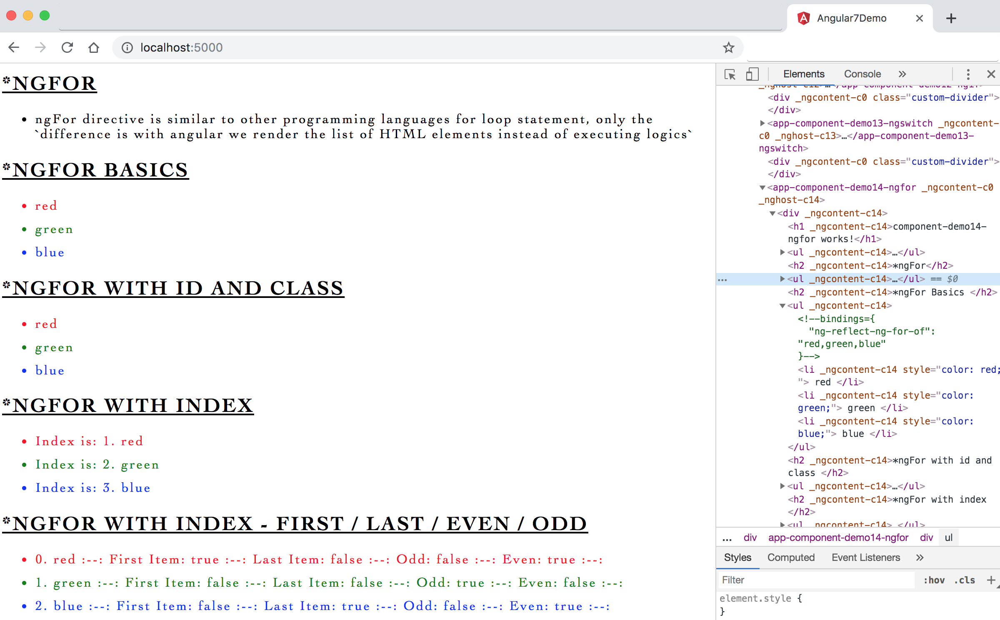
    <figcaption>&nbsp;&nbsp;&nbsp; Image - Output - *ngFor - Structural directive to render/loop html elements from an array/object</figcaption>
  </figure>
</p>

15 Component Interaction
=====================
- Component interact [parent to child and vice versa] with @input() & @output() decorator
    - **@input() decorator** - Parent component sends data, Child component accepts with @input() decorator `(parent to child component communication with @input() decorator)`
    - **@output() decorator** - Child component sends data/events, Parent component accepts with @output() decorator `(child to parent component communication with @output() decorator)`
- To send data from Child to Parent we need events i.e. create `Events-EventEmitter`

15.1. Parent to child communication with @Input() decorator:
------------------------------
1. Parent class/.ts file - Create a property or class member/variable, example: `parentMessage = 'From Parent';`
2. Parent view/.html file - In child selector tag use parent variable with property binding for communication, example: `<app-component-demo15-childparent [parentData]="parentMessage"></app-component-demo15-childparent>`
3. Child component class/.ts file - Receive data data/value coming from parent component, example: `@Input() public parentData;`
4. Child view/.html file - Bind / Get Parent Data in Child component example: `Hello <strong>{{parentData}}</strong>`

> **Syntax & Example**: parent component - app.component.ts
```ts
import { Component } from '@angular/core';

@Component({
  selector: 'app-root',
  templateUrl: './app.component.html',
  styleUrls: ['./app.component.css']
})
export class AppComponent {
  // create a property to send from parent to child
  parentMessage = 'From Parent';
    
}
```

> **Syntax & Example**: parent component - app.component.html
```html
<!-- component interaction - parent to child and child to parent communication -->

<!-- send property from parent to child - include in child element component selector -->
<app-component-demo15-childparent [parentData]="parentMessage"></app-component-demo15-childparent>
```

> **Syntax & Example**: child component - component-demo15-childparent.component.ts
```ts
import { Component, OnInit, Input, Output, EventEmitter } from '@angular/core';

@Component({
  selector: 'app-component-demo15-childparent',
  templateUrl: './component-demo15-childparent.component.html',
  styleUrls: ['./component-demo15-childparent.component.css']
})
export class ComponentDemo15ChildparentComponent implements OnInit {
  // parent to child 

  // receive data data/value coming from parent component
  @Input() public parentData;
  // @Input() public parentName;

  // alias based method
  // @Input('parentData') public parentName;

  constructor() { }

  ngOnInit() {
  }

}
```

> **Syntax & Example**: child component - component-demo15-childparent.component.html
```html
<div>
  <h1>component-demo15-childparent works!</h1>

  <!-- parent to child -->

  <u>Bind / Get Parent Data in Child component</u>:
  Hello <strong>{{parentData}}</strong> <br /> <br /> <br />

  <!-- <u>bind / Get Parent Data in Child alias based method</u>:
  Hello <strong>{{parentName}}</strong> <br /><br /> -->
  
</div>
```

<p>
  <figure>
    &nbsp;&nbsp;&nbsp; 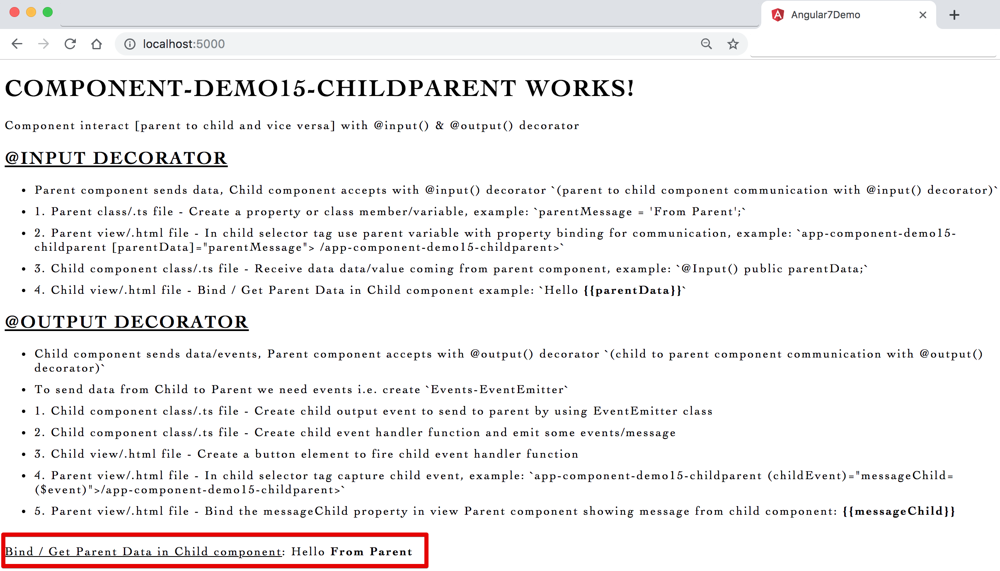
    <figcaption>&nbsp;&nbsp;&nbsp; Image - Output - component communication parent to child with input decorator</figcaption>
  </figure>
</p>

15.2. Child to parent communication with @Ouput() decorator:
------------------------------
1. Child component class/.ts file - Create child output event to send to parent by using EventEmitter class
2. Child component class/.ts file - Create child event handler function and emit some events/message
3. Child view/.html file - Create a button element to fire child event handler function
4. Parent view/.html file - In child selector tag capture child event, example: `<app-component-demo15-childparent (childEvent)="messageChild=($event)"></app-component-demo15-childparent>`
5. Parent view/.html file - Bind the messageChild property in view `<u>Parent component showing message from child component</u>: <strong>{{messageChild}}</strong>`

> **Syntax & Example**: child component - component-demo15-childparent.component.ts
```ts
import { Component, OnInit, Input, Output, EventEmitter } from '@angular/core';

@Component({
  selector: 'app-component-demo15-childparent',
  templateUrl: './component-demo15-childparent.component.html',
  styleUrls: ['./component-demo15-childparent.component.css']
})
export class ComponentDemo15ChildparentComponent implements OnInit {
  // parent to child 

  // receive data data/value coming from parent component
  @Input() public parentData;
  // @Input() public parentName;

  // alias based method
  // @Input('parentData') public parentName;

  // child to parent

  // create child event to send to parent
  @Output() public childEvent = new EventEmitter();

  // child event handler function
  childFireEvent() {
    this.childEvent.emit("Message from Child to Parent");
  }

  constructor() { }

  ngOnInit() {
  }

}
```

> **Syntax & Example**: child component - component-demo15-childparent.component.html
```html
<div>
    <h1>component-demo15-childparent works!</h1>
    <!-- child to parent -->

    <!-- Fire child event on button click -->
    <button (click)="childFireEvent()">Send Child Event to Parent</button>
</div>
```

> **Syntax & Example**: parent component - app.component.ts
```ts
import { Component } from '@angular/core';

@Component({
  selector: 'app-root',
  templateUrl: './app.component.html',
  styleUrls: ['./app.component.css']
})
export class AppComponent {
  // create a property to send from parent to child
  parentMessage = 'From Parent';
  
  // child to parent
  messageChild;
}
```

> **Syntax & Example**: parent component - app.component.html
```html
<!-- component interaction - parent to child and child to parent communication -->

<!-- send property from parent to child - include in child element component selector -->
<app-component-demo15-childparent [parentData]="parentMessage" (childEvent)="messageChild=($event)"></app-component-demo15-childparent>
```

<p>
  <figure>
    &nbsp;&nbsp;&nbsp; 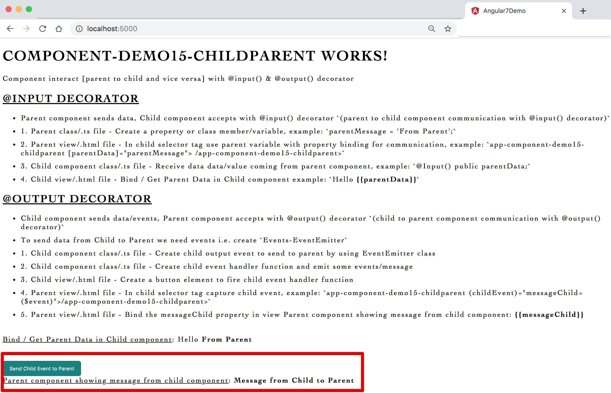
    <figcaption>&nbsp;&nbsp;&nbsp; Image - Output - component communication child to parent with ouput decorator</figcaption>
  </figure>
</p>

16 Pipes
=====================
- Pipes (Filters) helps to `transform data before displaying to view`
- Pipes (Filters) can be added in AngularJS to format data
- Pipes (Filters) is denoted by `piping |` symbol
- There are many built-in/default pipes available in angular like: `String related pipes` (uppercase, lowercase), `Number related pipes` (number), `Currency` pipes, `Date` pipes, `JSON` pipes. 
- We can also create custom pipes as per out requirements with `Pipe, PipeTransform class & transform method`

> **Syntax & Example**: component-demo16-pipesfilters.component.ts
```ts
import { Component, OnInit } from '@angular/core';

@Component({
  selector: 'app-component-demo16-pipesfilters',
  templateUrl: './component-demo16-pipesfilters.component.html',
  styleUrls: ['./component-demo16-pipesfilters.component.css']
})
export class ComponentDemo16PipesfiltersComponent implements OnInit {
  public nameText = 'Angular js';
  public messageText = 'Welcome to Angularjs';
  public greetingText = 'angular 2/4/5/6 is component based';

  public objTechnology = {
    'firstName': 'angular',
    'lastName': 'js',
    'version': 6.0
  }

  public number1 = 5.786;

  public currentDate = Date();

  constructor() { }

  ngOnInit() {
  }

}
```

> **Syntax & Example**: component-demo16-pipesfilters.component.html
```html
<div>
  <h1>component-demo16-pipesfilters works!</h1>

  <h2>pipes</h2>
  
  <h2>String based Pipes : Format string</h2>
  uppercase: {{ nameText | uppercase }} <br />
  lowercase: {{ messageText | lowercase }} <br />
  titlecase: {{ greetingText | titlecase }} <br />

  slice:start:end (not including that letter): {{ greetingText | slice:8}} <br />
  <!-- slice:starting point:limit/up to (not including that letter) -->
  slice:start:end (not including that letter): {{ greetingText | slice:14:15}} <br />

  <h2>JSON Pipes - Shows json representation of an object</h2>
  json: {{ objTechnology | json }} <br />

  <h2>Number Pipes - Format Number, Integers</h2>
  <!-- min integer digit. min decimal digit - max decimal digit. -->
  number (min integer digit. min decimal digit - max decimal digit): {{ 5.29898 | number:"1.2-3" }} <br />
  number (min integer digit. min decimal digit - max decimal digit): {{ 5.29898 | number:"2.2-2" }} <br />

  percent: {{ 0.29898 | percent }} <br />

  <h2>Currency Pipes - Transform Currency values</h2>
  currency: {{ 0.29898 | currency }}<br />
  currency: {{ 0.29898 | currency:'Rs.' }} <br />
  currency: {{ 0.29898 | currency:'GBP' }} <br />
  currency: {{ 0.29898 | currency:'GBP':'code' }} <br />

  <h2>Date Pipes - Transform Date</h2>
  Date: {{ currentDate }}<br />

  date:short: {{ currentDate | date:'short' }}<br />
  date:shortDate: {{ currentDate | date:'shortDate' }}<br />
  date:shortTime: {{ currentDate | date:'shortTime' }} <br /> <br />

  date:medium: {{ currentDate | date:'medium' }}<br />
  date:mediumDate: {{ currentDate | date:'mediumDate' }}<br />
  date:mediumTime: {{ currentDate | date:'mediumTime' }}<br /> <br />

  date:long: {{ currentDate | date:'long' }}<br />
  date:longDate: {{ currentDate | date:'longDate' }}<br />
  date:longTime: {{ currentDate | date:'longTime' }}<br /> <br />

</div>
```

<p>
  <figure>
    &nbsp;&nbsp;&nbsp; 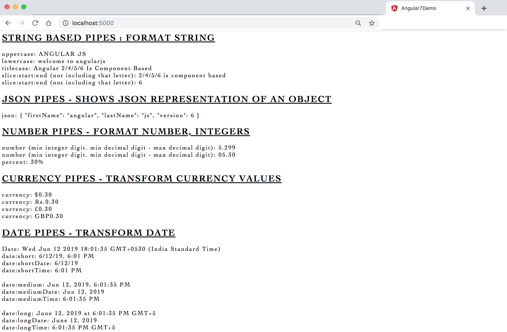
    <figcaption>&nbsp;&nbsp;&nbsp; Image - Output - Transform/Format data with pipes</figcaption>
  </figure>
</p>

17 Services
=====================
- Programming Principles:
    - **DRY** - Do not repeat yourself (DRY) - Avoid making copies of data in different files. (example: List & Details components using same employee object created twice in respective class file)
    - **SRP** - Single Responsibility Principles (one class/function should perform one task/responsibility)
    - **KISS** - Keep It Simple Stupid!
- Service is a class with a specific purpose and widely used to:
    - Share data - Between multiple pages/components
    - Implement application logic - Calculations, Repeatative tasks/functionalities etc.
    - External Interaction - Database connectivity
- Services are a great and awesome way to share information among multiple classes/components, just create a service and inject it in respective classes/components

18 Dependency Injection DI
=====================
- Drawback of code without Dependency Injection (DI):
    - Code is not flexible
    - If main code (dependencies) changed we need to check and change our code
    - Code is not suitable for testing
- Dependency Injection (DI) as a design pattern
    - Dependency Injection DI is a coding pattern/standard in which a class receives its required dependencies from external sources rather than creating them itself to avoid tight coupling
- Dependency Injection (DI) as a Framework - Register all dependencies with Injector a central place/container
    - 3 steps involved to create and use service in angular:
        1. Define the Service class 
        2. Register with Injector
        3. Declare as a dependency in List and Details both component
- `@Injectable()` decorator tells angular that this service might itself have injected dependencies

19 Using a Service
=====================
- 3 steps involved to create and use service in angular:
    1. Define the Service class 
    2. Register with Injector
    3. Declare as a dependency in List and Details both component
    &nbsp;  

1.Define the Service class 
---------------------
1. Create service (which is responsible for providing employee data) with the command "ng g s employee" OR "ng generate service employee"

> **Syntax & Example**: employee.service.ts
```ts
import { Injectable } from '@angular/core';

@Injectable({
  providedIn: 'root'
})
export class EmployeeService {
  // 1.1. create a new method which holds employee data
  getEmployees() {
    return [
      { 'id': 1, 'name': 'Amitabh', 'age': 75, 'city': 'Alahabad' },
      { 'id': 2, 'name': 'Akshay', 'age': 55, 'city': 'Delhi' },
      { 'id': 3, 'name': 'RajaniKanth', 'age': 73, 'city': 'Chennai' },
      { 'id': 4, 'name': 'Rajesh Khanna', 'age': 85, 'city': 'Kolkatta' }
    ]
  }

  constructor() { }

}
```

2.Register with Injector
--------------------- 
2. Register with Injector in app module file `'app.module.ts'`

> **Syntax & Example**: app.module.ts
```ts 
// 2.1. import custom created service to Register with Injector
import { EmployeeService } from './services/employee.service';

// 2.2. import service in providers its compulsion to insert services in the provider's array
providers: [ EmployeeService ]
```

3.Declare as a dependency in both List and Details component
---------------------
3. import service in necessary component files - Declare as dependency in constructor
employee-list.component.ts & employee-details.component.ts

> **Syntax & Example**: component-demo191-serviceemployeelist.component.ts & component-demo192-serviceemployeedetails.component.ts
```ts
import { Component, OnInit } from '@angular/core';

// 3.1. import service in necessary component files - Declared as dependency
import { EmployeeService } from '../../services/employee.service';

@Component({
  selector: 'app-component-demo191-serviceemployeelist',
  templateUrl: './component-demo191-serviceemployeelist.component.html',
  styleUrls: ['./component-demo191-serviceemployeelist.component.css']
})
export class ComponentDemo191ServiceemployeelistComponent implements OnInit {
  // 3.3. define an empty local employees array which will hold employees data after service all
  public employees = [];

  // 3.2. refer to service with local variable as dependency in constructor
  constructor(private employeeService: EmployeeService) { }

  ngOnInit() {
    // 3.4. on component initialization get values from service method
    this.employees = this.employeeService.getEmployees();
  }

}
```

4.Add Markup and bind required data in template/view - employee-list.component.html (component-demo191-serviceemployeelist.component.html) file:
---------------------
> **Syntax & Example**: 
```html
<h2>Employee list:</h2>
<ul>
    <li *ngFor="let employee of employees">
        {{employee.id}} {{employee.name}} 
    </li>
</ul>
```

5.Add Markup and bind required data in template/view - employee-details.component.html file: component-demo192-serviceemployeedetails.component.html
---------------------
> **Syntax & Example**: 
```html
<div>
  <h1>component-demo192-serviceemployeedetails works!</h1>

  <h2>Employee Details list:</h2>
  <ul>
    <li *ngFor="let employee of employees">
      {{employee.id}} {{employee.name}} {{employee.age}} {{employee.city}}
    </li>
  </ul>

</div>
```

<p>
  <figure>
    &nbsp;&nbsp;&nbsp; 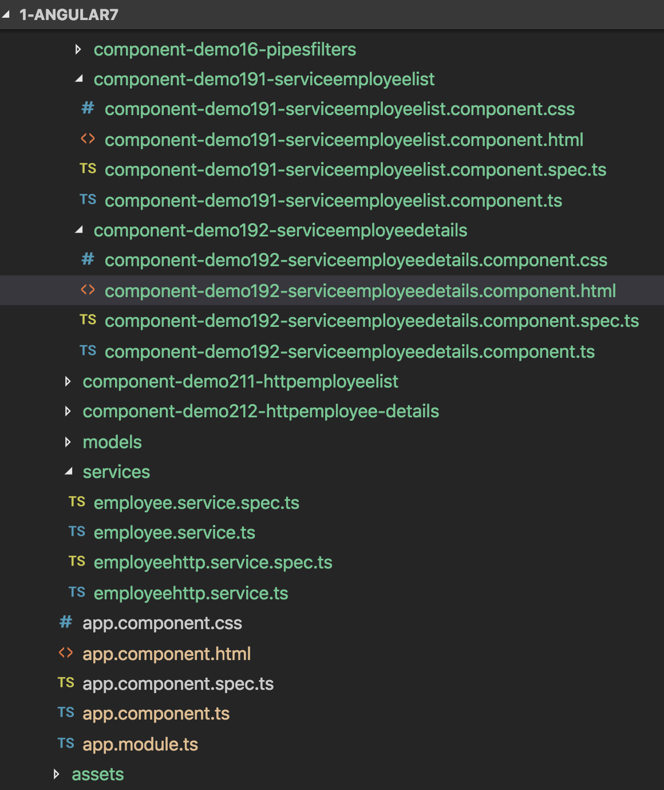
    <figcaption>&nbsp;&nbsp;&nbsp; Image - Output - services and component folder structure</figcaption>
  </figure>
</p>

<p>
  <figure>
    &nbsp;&nbsp;&nbsp; 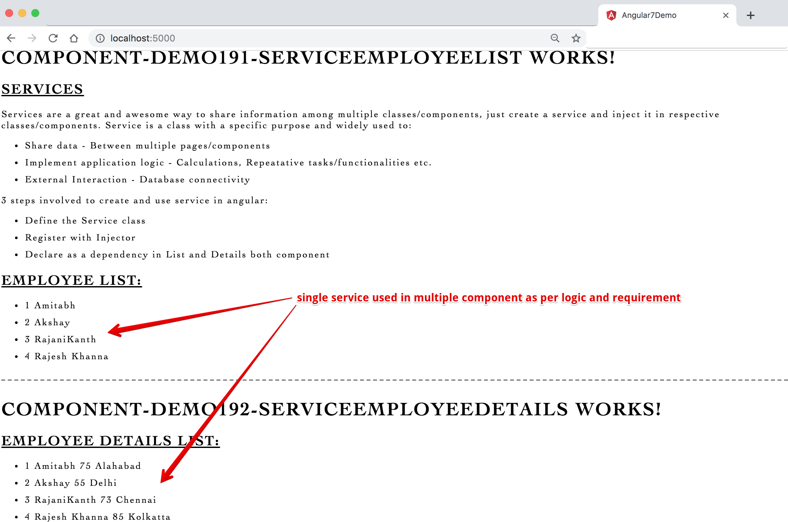
    <figcaption>&nbsp;&nbsp;&nbsp; Image - Output - single service used in multiple component as per logic and requirement</figcaption>
  </figure>
</p>

20 HTTP and Observables
=====================
- Http services are used to fetch the data from web server (instead of using hard coded data/json files)

20.1. Http Mechanism: 
---------------------
1. Send http request 
2. Receive and process http response

### Request: 
Component file calls -> Service -> Get -> HTTP -> request -> server (DB)

### Response: 
Component file calls <- Service (cast data) <- Observable <- HTTP <- response <- server (DB)

### Observables: 
The response/results/returns which we get from the HTTP call is nothing but an Observables. The service needs to cast Observables into an Array/Object and then pass to the required components.

20.2. What exactly are Observables?
---------------------
- A sequence of data/items that arrive asynchronously over time
- HTTP Call = Single item and Single item = HTTP response
- Observables are HTTP response which arrives asynchronously

20.3. HTTP, Observables, and RxJS:
---------------------
- 4 steps to fetch data from HTTP & observables:
    1. HTTP Get request from service
    2. Receive the observable and cast it into an array/Object
    3. Subscribe to the observable from List and Details component class
    4. Assign the received array/Object to a local variable

20.4. RxJS
---------------------
- Reactive Extensions for JavaScript
- External library to work with Observables 
- No-where related to ReactJS library from Facebook

21 Fetch Data Using HTTP and Observables
=====================
- Http & HttpClientModule:
- Till Angular 4 - Http module used
- In Angular 5 - HttpClientModule used (HttpClientModule provides simplified APIs to work with http functionality)
- We know an Observables are return as result of a http call, to handle an exceptions on observables we make a use of 'catch' operator
<br /><br />
- 4 steps to fetch data from http & observables:
    1. HTTP Get request from service
    2. Receive the observable and cast it into an array/Object
    3. Subscribe to the observable from List and Details component class
    4. Assign the received array/Object to local variable
- create a custom service to handle http data with command: ng g s employeeHttp

1.HTTP Get request from service
---------------------
> **Syntax & Example**: 1. app.module.ts
```ts
 // import HttpClientModule and add to imports array
    // 1a. import HttpClientModule
    import { HttpClientModule } from '@angular/common/http'

    // 1b. add to imports array
    imports: [
        BrowserModule,
        BrowserAnimationsModule,
        FormsModule,
        HttpClientModule
    ],
     
    // 1c. import custom created service Register with Injector
    import { EmployeeHttpService } from './employee-http.service';

    // import service in providers
    providers: [EmployeeService, EmployeeHttpService],
```

2.Receive the observable and cast it into an array/Object
---------------------
> **Syntax & Example**: 2. employee-http.service.ts
```ts
import { Injectable } from '@angular/core';
import { HttpClient } from '@angular/common/http';
import { Observable } from 'rxjs';
import { IEmployee } from '../models/iemployee';

@Injectable({
  providedIn: 'root'
})
export class EmployeehttpService {
  // 2c. create json data file
  private jsonUrl:string= "/assets/data/employees.json";

  // 2a. create local variable for HttpClient as DI
  constructor(private httpClient: HttpClient) { }

  // 2b. http get
  getEmployees(): Observable<IEmployee[]> {
    return this.httpClient.get<IEmployee[]>(this.jsonUrl);
  }
  
}

/* 
// 2a. create local variable for HttpClient as DI
    constructor(private _HttpClient:HttpClient) { }

    import { HttpClient } from '@angular/common/http';

    // 2b. in a getEmployees method make get request
    // getEmployees(){
    //   return this._HttpClient.get(_jsonUrl);
    // }

    // 2b. http get
    getEmployees():Observable<IEmployee[]>{
        return this._HttpClient.get<IEmployee[]>(this._jsonUrl);
    }

    // 2c. create json data file
    private _jsonUrl:string= "/assets/data/employees.json";

    // import model/interface file
    import { IEmployee } from './employee-model-interface';
    import { Observable } from 'rxjs/Observable';
*/
```

> **Syntax & Example**: 3. ceate employees.json data file inside assets/data folder
```json
[
    { "id": 1, "name": "Amitabh", "age": 75, "city": "Alahabad" },
    { "id": 2, "name": "Akshay", "age": 55, "city": "Delhi" },
    { "id": 3, "name": "RajaniKanth", "age": 73, "city": "Chennai" },
    { "id": 4, "name": "Rajesh Khanna", "age": 85, "city": "Kolkatta" }
]

[
    {"id":1, "name":"Ratan Tata", "age":75},
    {"id":2, "name":"Adi Godrej", "age":65},
    {"id":3, "name":"K M Birla", "age":55},
    {"id":4, "name":"Laxmi Mittal", "age":58},
    {"id":5, "name":"Chanda Kochar", "age":50},
    {"id":6, "name":"Amitabh B", "age":76}
]
```

> **Syntax & Example**: 4. create IEmployee.ts an employee model/interface file to store exact data types and rules
```ts
export interface IEmployee {
    id:number;
    name:string;
    age:number
}
```

3.Subscribe to the observable from List and Details component class<br/>
4.Assign the received array/Object to local variable
---------------------
> **Syntax & Example**: 3. employee-http-list.component.ts
```ts
import { Component, OnInit } from '@angular/core';
import { EmployeehttpService } from '../services/employeehttp.service';

@Component({
  selector: 'app-component-demo211-httpemployeelist',
  templateUrl: './component-demo211-httpemployeelist.component.html',
  styleUrls: ['./component-demo211-httpemployeelist.component.css']
})
export class ComponentDemo211HttpemployeelistComponent implements OnInit {
  public employees = [];

  constructor(private employeehttpService: EmployeehttpService) { }

  ngOnInit() {
    // on component initialization get value from http subscribe
    // data =>: argument of the function
    // this.employees = data: body of the function
    // subscribe: to receive data
    this.employeehttpService.getEmployees().subscribe(data => this.employees = data)
  }

}
```

> **Syntax & Example**: component-demo211-httpemployeelist.component.html
```html
<div>
  <h1>component-demo211-httpemployeelist works!</h1>

  <h2>HTTP Services and Observables</h2>

  <h2>Employee HTTP Observables list:</h2>
  <ul>
    <li *ngFor="let employee of employees">
      {{employee.id}} {{employee.name}}
    </li>
  </ul>

</div>
```

> **Syntax & Example**: component-demo212-httpemployee-details.component.html
```html
<div>
  <h1>component-demo212-httpemployee-details works!</h1>

  <h2>Employee HTTP Observables Details list:</h2>
  <ul>
    <li *ngFor="let employee of employees">
      {{employee.id}} {{employee.name}} {{employee.age}} {{employee.city}}
    </li>
  </ul>

</div>
```

<p>
  <figure>
    &nbsp;&nbsp;&nbsp; 
    <figcaption>&nbsp;&nbsp;&nbsp; Image - Output - http-observables services and component folder structure</figcaption>
  </figure>
</p>

<p>
  <figure>
    &nbsp;&nbsp;&nbsp; 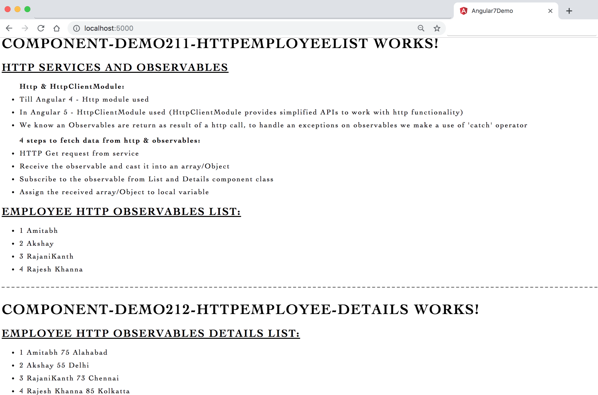
    <figcaption>&nbsp;&nbsp;&nbsp; Image - Output - http-observables</figcaption>
  </figure>
</p>

22 Creating Custom Directives
=====================
- We know that Directives are an `instructions in the DOM`, they specify how to place your components and business logic in the Angular
- There are many inbuilt structural directives like `ngIf`, `ngSwitch` and `ngFor` used widely in angular
- We can also create custom directives to implement some common logic/functionality (not existing) as a class `declared as @directive` 

Let's create a custom attribute directive to highlight text with blue color & italic style
---------------------
1. The command to create directive: `ng generate directive name` OR `ng g directive name`.
    1. In the current app, we want to create all custom directives under `directives` folder so use command as: `ng generate directive directives/blueHighlight`
    2. The above command will generate and update the following:
```
    CREATE src/app/directives/blue-highlight.directive.spec.ts (253 bytes)
    CREATE src/app/directives/blue-highlight.directive.ts (155 bytes)
    UPDATE src/app/app.module.ts (4690 bytes)
```
> **Syntax & Example**: app.module.ts will be updated automatically with new directive entry
```ts
// 22. directives - import custom created directives
import { BlueHighlightDirective } from './directives/blue-highlight.directive';

declarations: [
    BlueHighlightDirective
],
```

2. Once directive created, in `blue-highlight.directive.ts` assign/change selector name from `appBlueHighlight` to `"blueHighlight"` or so. 
    1. Open any component html file and use `"blueHighlight"` directive as a attribute (i am trying in app.component.html):  `<h1 blueHighlight> Hello World! I am custom directive </h1>`
    2. To target, get or capture the current html element we can import and use `ElementRef` and `nativeElement` utilities

3. Directives called before the element is rendered so it's advisable to perform all content related actions inside `ngOnInit()` life cycle hook

> **Syntax & Example**: blue-highlight.directive.ts
```ts
import { Directive, ElementRef } from '@angular/core';

@Directive({
  selector: '[blueHighlight]'
})
export class BlueHighlightDirective {

  constructor(private elem:ElementRef) { 
    console.log('current Element:', elem);
    // elem.nativeElement.innerText= 'Dynamic text innerHTML';
    elem.nativeElement.style.color = `#0000ff`;
    elem.nativeElement.style.fontStyle = 'italic';
    elem.nativeElement.style.backgroundColor   = '#c7c7ff';
  }

}
```

> **Syntax & Example**: app.component.html
```html
<!-- custom directive  -->
<h1> 22 Hello World! Lets learn custom directive </h1>

<li blueHighlight> I am custom directive </li>

<p>The command to create directive: <span blueHighlight>`ng generate directive blueHighlight`</span> OR <span blueHighlight>`ng g directive blueHighlight`</span>. In current app we want to create all custom directives under `directives` folder so use command as: <span blueHighlight>`ng generate directive directives/blueHighlight`</span>. Above command will Genreate and Update following: <br/>
<br/>
<span blueHighlight>CREATE</span> src/app/directives/blue-highlight.directive.spec.ts (253 bytes) <br/>
<span blueHighlight>CREATE</span> src/app/directives/blue-highlight.directive.ts (155 bytes) <br/>
<span blueHighlight>UPDATE</span> src/app/app.module.ts (4690 bytes) <br/>
</p>
```

<p>
  <figure>
    &nbsp;&nbsp;&nbsp; 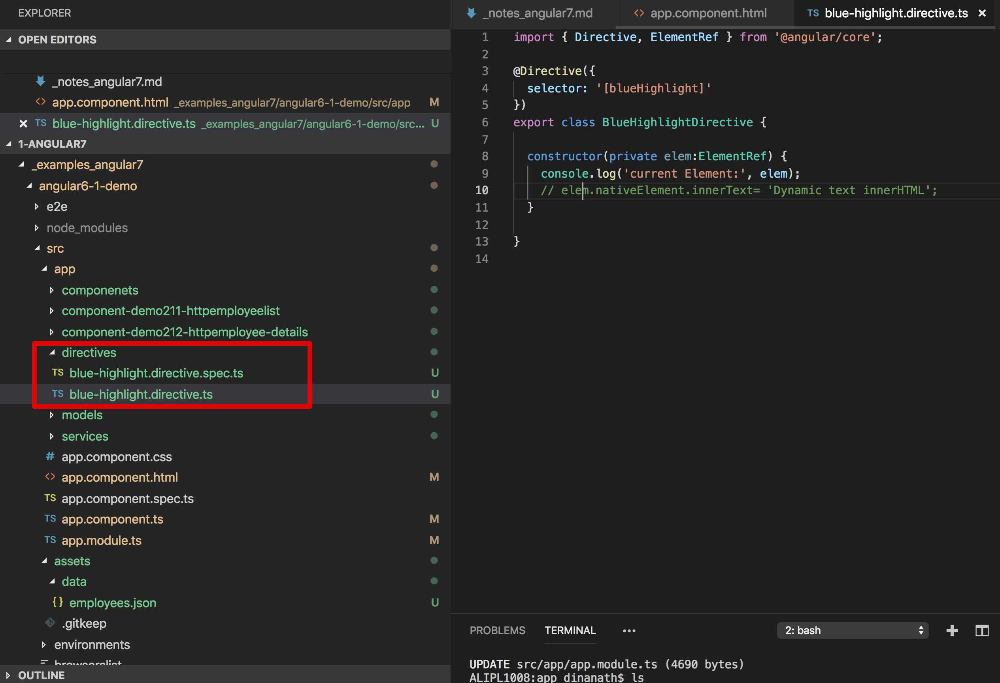
    <figcaption>&nbsp;&nbsp;&nbsp; Image - Output - custom-directives folder structure</figcaption>
  </figure>
</p>

<p>
  <figure>
    &nbsp;&nbsp;&nbsp; 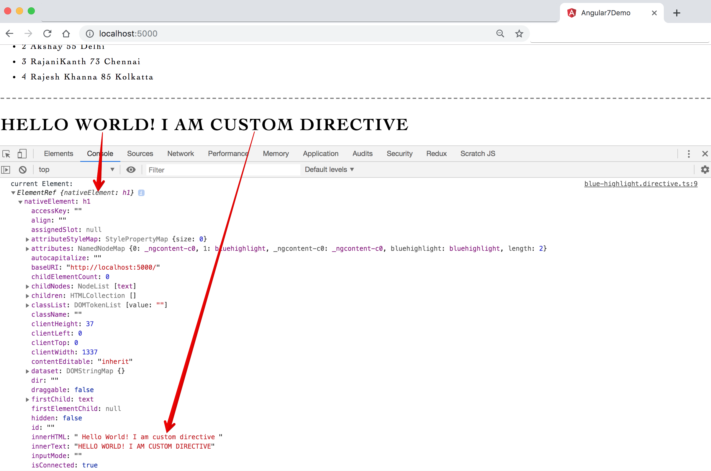
    <figcaption>&nbsp;&nbsp;&nbsp; Image - Output - custom-directives elementref nativelement</figcaption>
  </figure>
</p>

<p>
  <figure>
    &nbsp;&nbsp;&nbsp; 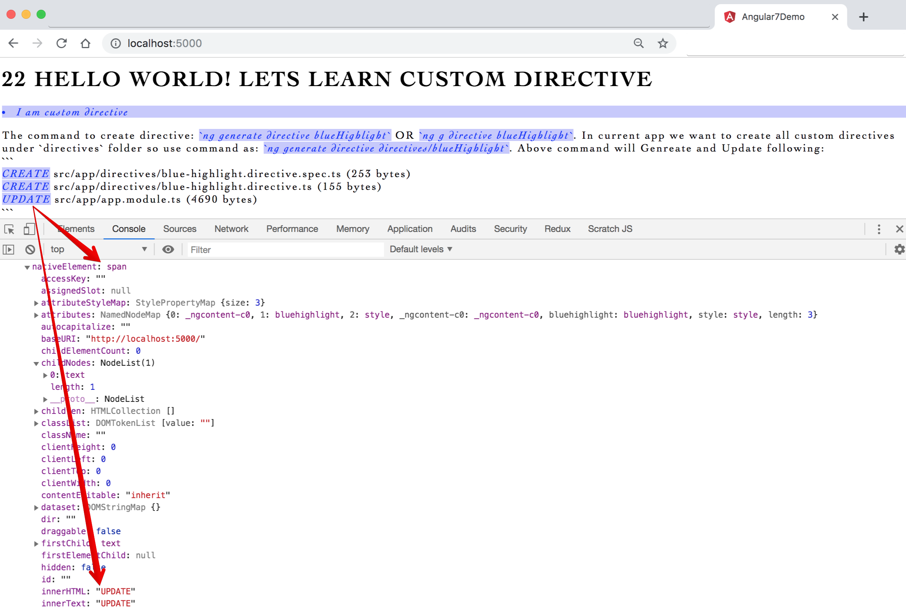
    <figcaption>&nbsp;&nbsp;&nbsp; Image - Output - custom-directives elementref nativelement style</figcaption>
  </figure>
</p>

23 Custom Directives with Events and HostListener
=====================
- In Angular, the `@HostListener() function decorator` allows you to handle events of the host element in the directive class
- `@HostListener Decorator` declares a DOM event to listen for, and provides a handler method to run when that event occurs
- Basic syntax of @Hostlistener is:
    - `@Hostlistener('eventName',[args])` OR `@Hostlistener('target:EVENT',[args])`
    - **eventName**: The CSS event to listen for
    - **args**: A set of arguments to pass to the handler method when the event occurs

Let's create a custom attribute directive to highlight text and also have a click event
---------------------
1. The command to create directive: `ng generate directive name` OR `ng g directive name`.
    1. In the current app, we want to create all custom directives under `directives` folder so use command as: `ng generate directive directives/highlightClick`
    2. The above command will generate and update the following:
```
    CREATE src/app/directives/highlight-cilck.directive.spec.ts (257 bytes)
    CREATE src/app/directives/highlight-cilck.directive.ts (157 bytes)
    UPDATE src/app/app.module.ts (4855 bytes)
```
> **Syntax & Example**: app.module.ts will be updated automatically with new directive entry
```ts
/// 23. directives - import custom created directives
import { HighlightCilckDirective } from './directives/highlight-cilck.directive';

declarations: [
    HighlightCilckDirective
],
```

2. Once directive created, in `highlight-cilck.directive.ts` assign/change selector name from `appHighlightCilck` to `"highlightCilck"` or so. 
    1. Open any component html file and use `"highlightCilck"` directive as a attribute (i am trying in app.component.html):  `<h1 highlightCilck> Hello World! I am custom directive with Click</h1>`
    2. To target, get or capture the current html element we can import and use `ElementRef` and `nativeElement` with `@HostListener` utilities

> **Syntax & Example**: blue-highlight.directive.ts
```ts
import { Directive, ElementRef, HostListener } from '@angular/core';

@Directive({
  selector: '[highlightCilck]'
})
export class HighlightCilckDirective {

  constructor(private elem: ElementRef) {
    console.log('current Element:', elem);
    // elem.nativeElement.innerText= 'Dynamic text innerHTML';
    elem.nativeElement.style.color = `#ff0000`;
    elem.nativeElement.style.backgroundColor = '#ffd5d5';
    elem.nativeElement.style.cursor = 'pointer';
  }

  // element click event - @Hostlistener('eventName',[args])
  @HostListener('click') showAlert() {
    window.alert('Custom Directive - @HostListener events!');
  }

  // use global objects like document/window click - @Hostlistener('target:EVENT',[args])
  // @HostListener('document:click', ['$event'])
  // showElementClicked(elem) {
  //   window.alert('Document Clicked');
  // }
}
```

> **Syntax & Example**: app.component.html
```html
<!-- custom directive with @HostListener -->
  <h1> 23 Hello World! Lets learn custom directive with click </h1>

  <li highlightCilck> I am custom directive </li>

  <p>The command to create directive: <span highlightCilck>`ng generate directive highlightCilck`</span> OR <span highlightCilck>`ng g directive highlightCilck`</span>. In current app we want to create all custom directives under `directives` folder so use command as: <span highlightCilck>`ng generate directive directives/highlightCilck`</span>. Above command will Genreate and Update following: <br/>
  <br/>
    <span highlightCilck>CREATE</span> src/app/directives/blue-highlight.directive.spec.ts (253 bytes) <br/>
    <span highlightCilck>CREATE</span> src/app/directives/blue-highlight.directive.ts (155 bytes) <br/>
    <span highlightCilck>UPDATE</span> src/app/app.module.ts (4690 bytes) <br/>
  </p>
```

<p>
  <figure>
    &nbsp;&nbsp;&nbsp; 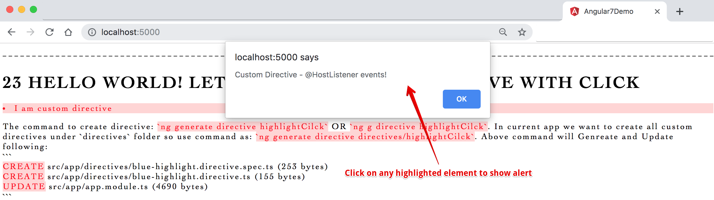
    <figcaption>&nbsp;&nbsp;&nbsp; Image - Output - custom-directives events @hostlistener</figcaption>
  </figure>
</p>

24 Creating Custom Pipes
=====================
- We learnt that Pipes (Filters) helps to `transform data before displaying to view`, `format the data`
- There are many inbuilt pipes like `uppercase`, `number`, `currency` and `date` used widely in angular to transform data
- We can also create custom pipes as per our requirements with `Pipe, PipeTransform class & transform method`

Let's create a custom pipe to get the square root of the given number
---------------------
1. Inside `app/pipes` folder create a new .ts file named `squareRootPipe.ts`
2. In `squareRootPipe.ts` to create a custom pipe we need to import `Pipe, PipeTransform class from @angular/core and also use transform method`
3. Also in the `@Pipe directive` we have to give the name to the current pipe, which will be used in the .html file, like `name: 'squareRootPipe'`
4. In `app.module.ts` file import and add in declarations `squareRootPipe.ts` as it's created manually

* To create a pipe using angular CLI:
    - `syntax`: ng generate pipe pipeName OR ng generate pipe path/pipeName
    - `command`: ng generate pipe pipes/reversText
* The above command will generate pipe `reversTextPipe.ts` with `@Pipe` decorator, implements `PipeTransform` and also update the src/app/app.module.ts with necessary imports entries

> **Syntax & Example**: squareRootPipe.ts
```ts
import { Pipe, PipeTransform } from '@angular/core';

@Pipe({
  name: 'squareRootPipe'
})

export class SquareRootPipe implements PipeTransform {
  transform(curValue: number): number {
    return Math.sqrt(curValue);
  }

}
```

> **Syntax & Example**: app.module.ts
```ts
// 24. pipes - import custom created pipes
import { SquareRootPipe } from './pipes/squareRootPipe';

declarations: [
    SquareRootPipe
],
```

> **Syntax & Example**: app.component.html
```html
<!-- custom pipe  -->
<h1> 24 Lets learn custom pipe to format/transform data </h1>

<ul>
    <li>Square Root of 81 is: {{ 81 | squareRootPipe }}</li>
    <li>Square Root of 100 is: {{ 100 | squareRootPipe }}</li>
</ul>
```

<p>
  <figure>
    &nbsp;&nbsp;&nbsp; 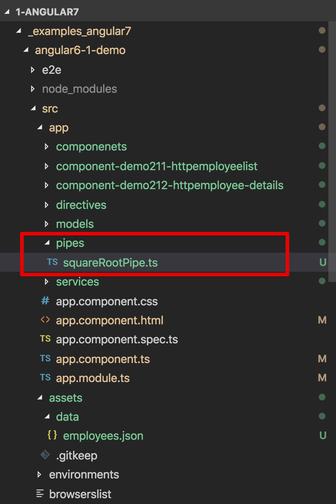
    <figcaption>&nbsp;&nbsp;&nbsp; Image - Output - custom-pipes-filters folder structure</figcaption>
  </figure>
</p>

<p>
  <figure>
    &nbsp;&nbsp;&nbsp; 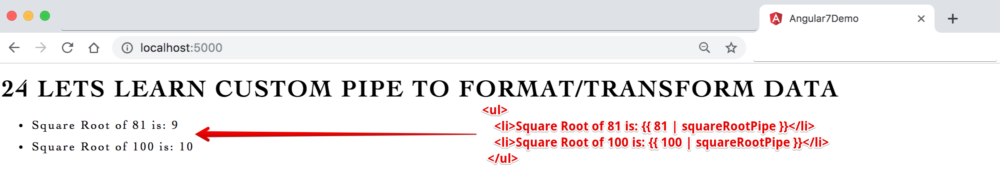
    <figcaption>&nbsp;&nbsp;&nbsp; Image - Output - custom-pipes, filters with pipe & pipeTransform</figcaption>
  </figure>
</p>
